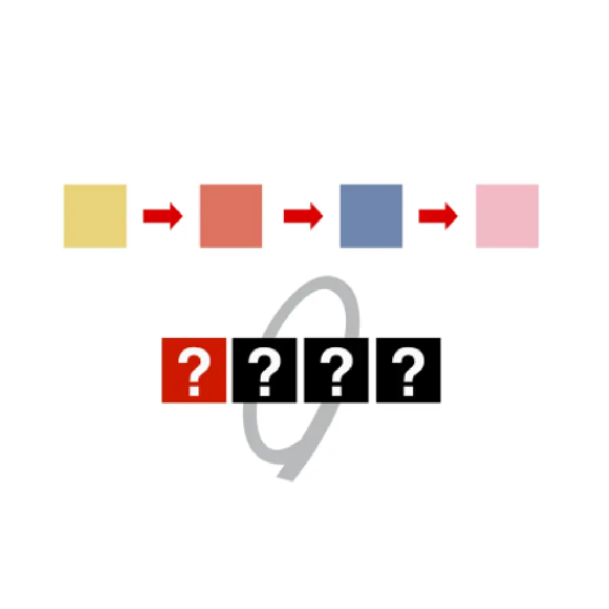

# 千字谜子题 149

## 题面

## 答案

`孤`

## 解析

注意到结束乐队出自孤独摇滚，所以提取孤

## 本地附件

- [9a843630315043f8a4ad7272d6149c05.webp](../../../assets/static.cipherpuzzles.com/static/images/9a843630315043f8a4ad7272d6149c05.webp)

来源：[https://ccbc16.cipherpuzzles.com/data/c16-qian-puzzle.json#cid=149](https://ccbc16.cipherpuzzles.com/data/c16-qian-puzzle.json#cid=149)
