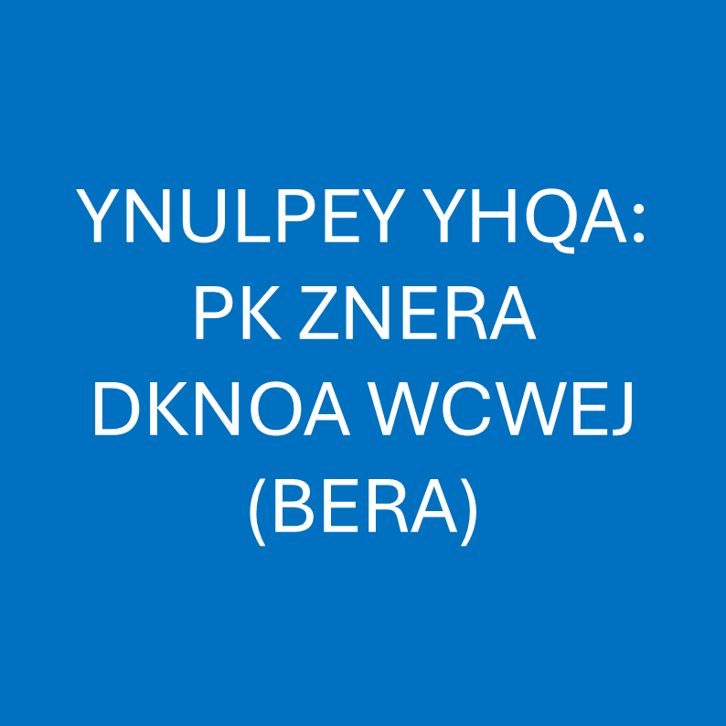

# 千字谜子题 15

## 题面

## 答案

`驭`

## 解析

_官方存档未填写解析。_

## 本地附件

- [dd515f2e84a94fe8856edfcd8932441b.webp](../../../assets/static.cipherpuzzles.com/static/images/dd515f2e84a94fe8856edfcd8932441b.webp)

来源：[https://ccbc16.cipherpuzzles.com/data/c16-qian-puzzle.json#cid=15](https://ccbc16.cipherpuzzles.com/data/c16-qian-puzzle.json#cid=15)
