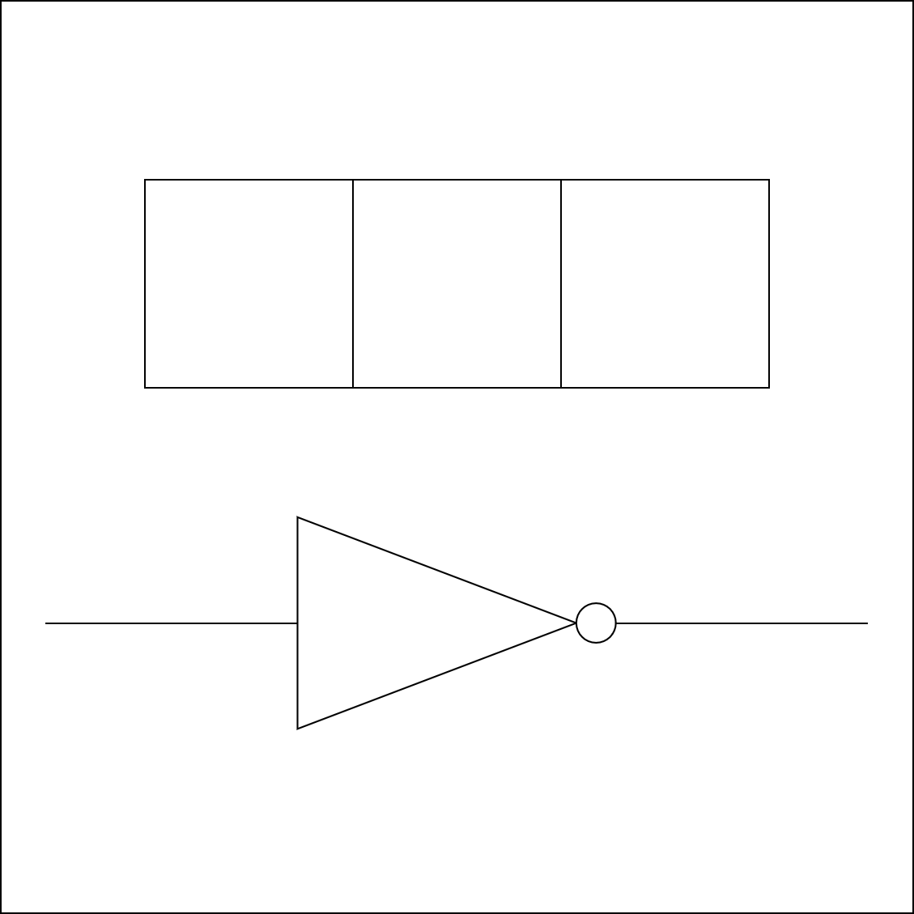

# 千字谜子题 150

## 题面

## 答案

`罪`

## 解析

图片上半部分为四字头，下半部分为非门，组合成为“罪”。

## 本地附件

- [d8571f0f2bdb4cc482927da7971b611d.webp](../../../assets/static.cipherpuzzles.com/static/images/d8571f0f2bdb4cc482927da7971b611d.webp)

来源：[https://ccbc16.cipherpuzzles.com/data/c16-qian-puzzle.json#cid=150](https://ccbc16.cipherpuzzles.com/data/c16-qian-puzzle.json#cid=150)
