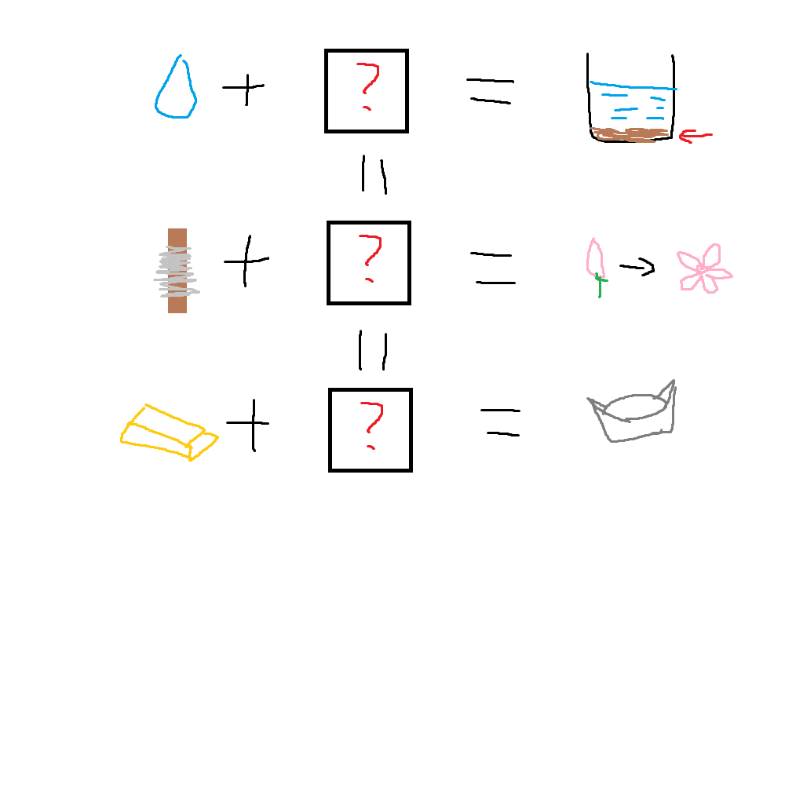

# 千字谜子题 152

## 题面

## 答案

`定`

## 解析

每张图表示一个字，三组等式分别为：水+定=淀；丝+定=绽；金+定=锭。所以问号处填入“定”字。

## 本地附件

- [6a6e77e2cae24391bf0363075e80a201.webp](../../../assets/static.cipherpuzzles.com/static/images/6a6e77e2cae24391bf0363075e80a201.webp)

来源：[https://ccbc16.cipherpuzzles.com/data/c16-qian-puzzle.json#cid=152](https://ccbc16.cipherpuzzles.com/data/c16-qian-puzzle.json#cid=152)
