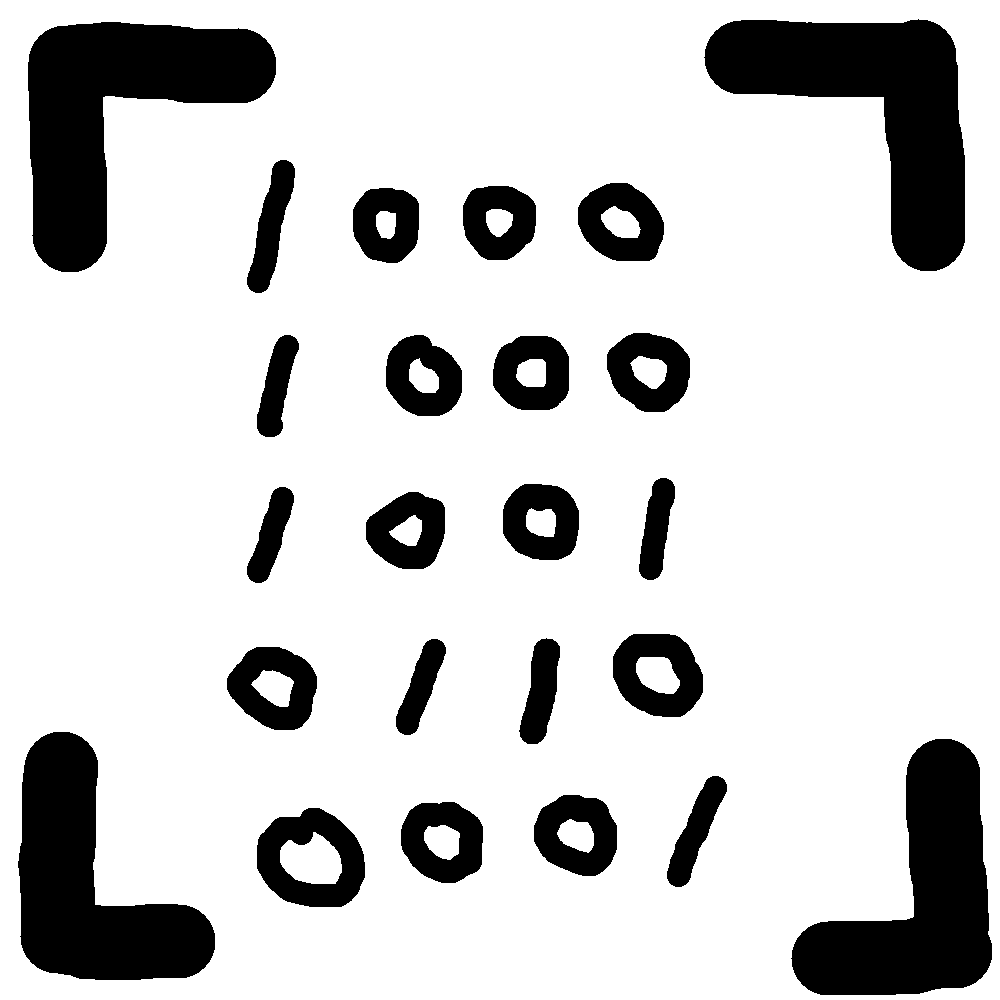

# 千字谜子题 153

## 题面

## 答案

`籍`

## 解析

周围的四个角代表要查四角号码
中间显然二进制
转出来结果是88961
是“籍”的四角号码

## 本地附件

- [051ce60eb87642c3af67124d8eca398e.webp](../../../assets/static.cipherpuzzles.com/static/images/051ce60eb87642c3af67124d8eca398e.webp)

来源：[https://ccbc16.cipherpuzzles.com/data/c16-qian-puzzle.json#cid=153](https://ccbc16.cipherpuzzles.com/data/c16-qian-puzzle.json#cid=153)
