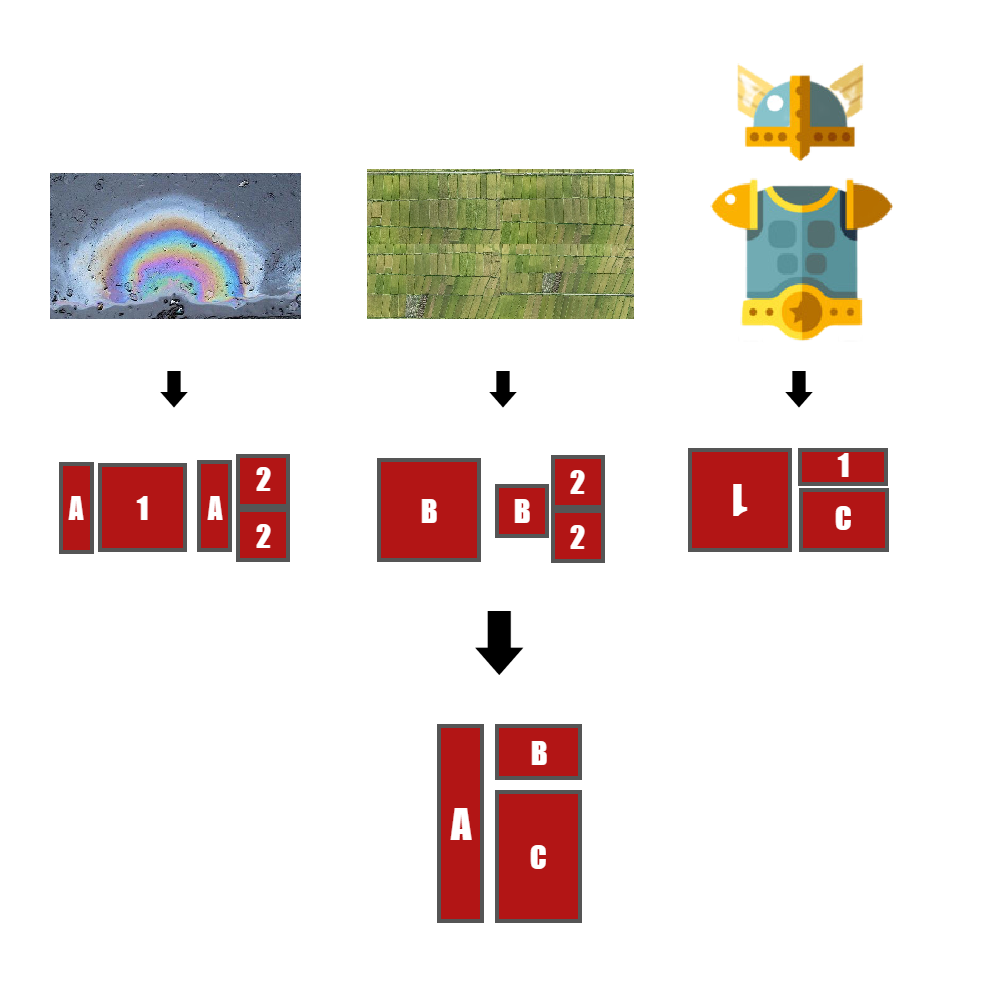

# 千字谜子题 154

## 题面

## 答案

`渭`

## 解析

本题为日谜风格。相同的字母或者数字代表相同的组字结构。
图1实物为“油洼”，A为“氵”，1为“由”，2为“土”。
由此得到图2为“田畦”，B为“田”；图3为“甲胄”，C为月字底（注意图3有一个1是倒过来的，表示“由”倒过来变成了“甲”）。
当然，也可以先解决图2，3再反推图1。
组合ABC，可以得到最终答案为“渭”。

## 本地附件

- [9a118328a1274363be07effe04000c18.webp](../../../assets/static.cipherpuzzles.com/static/images/9a118328a1274363be07effe04000c18.webp)

来源：[https://ccbc16.cipherpuzzles.com/data/c16-qian-puzzle.json#cid=154](https://ccbc16.cipherpuzzles.com/data/c16-qian-puzzle.json#cid=154)
