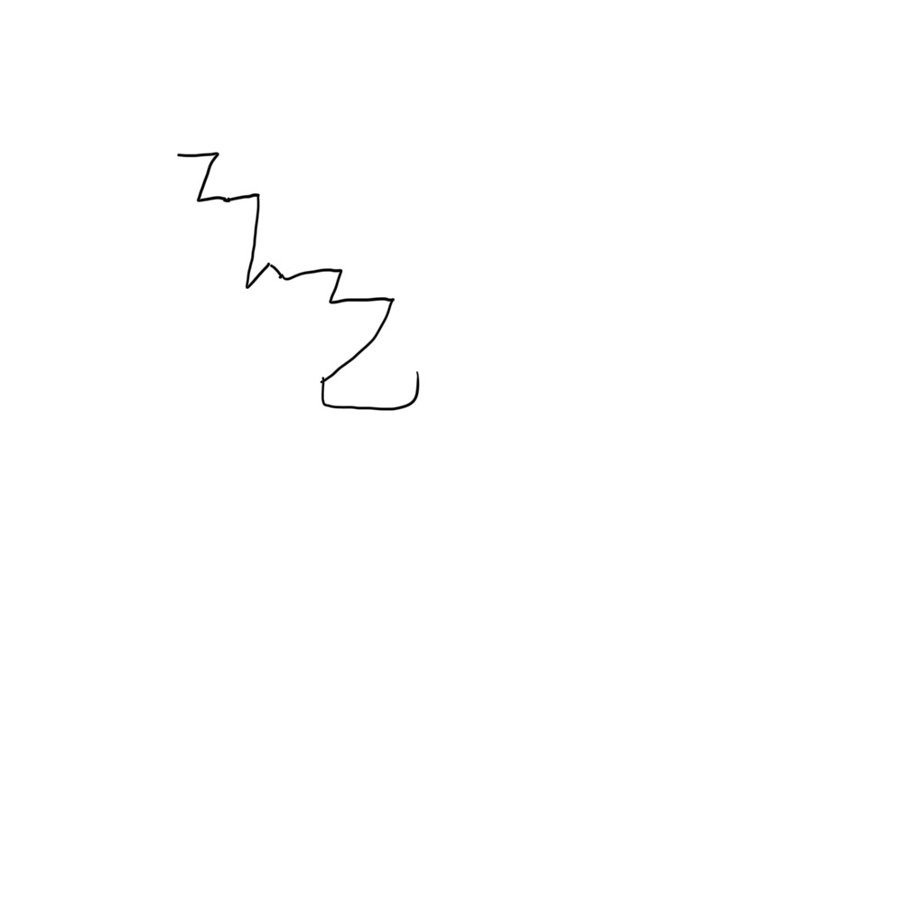

# 千字谜子题 155

## 题面

（九）

## 答案

`既`

## 解析

一笔画

## 本地附件

- [eba2e931060448df90ddce4ad781ba20.webp](../../../assets/static.cipherpuzzles.com/static/images/eba2e931060448df90ddce4ad781ba20.webp)

来源：[https://ccbc16.cipherpuzzles.com/data/c16-qian-puzzle.json#cid=155](https://ccbc16.cipherpuzzles.com/data/c16-qian-puzzle.json#cid=155)
