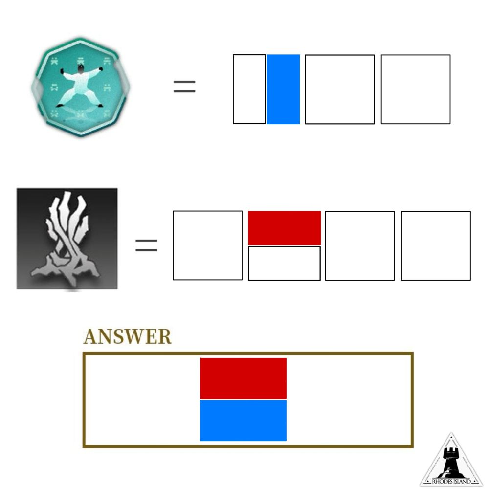

# 千字谜子题 156

## 题面

## 答案

`劳`

## 解析

识图可知两个图标均为明日方舟游戏内素材(右下角标志亦有提示)，两张图片分别为“勤运体”与“汲营枯枝”，提取对应文字部件后可得答案为“劳”。

## 本地附件

- [bf8c737cb86341509c30f4eda7f46ca1.webp](../../../assets/static.cipherpuzzles.com/static/images/bf8c737cb86341509c30f4eda7f46ca1.webp)

来源：[https://ccbc16.cipherpuzzles.com/data/c16-qian-puzzle.json#cid=156](https://ccbc16.cipherpuzzles.com/data/c16-qian-puzzle.json#cid=156)
