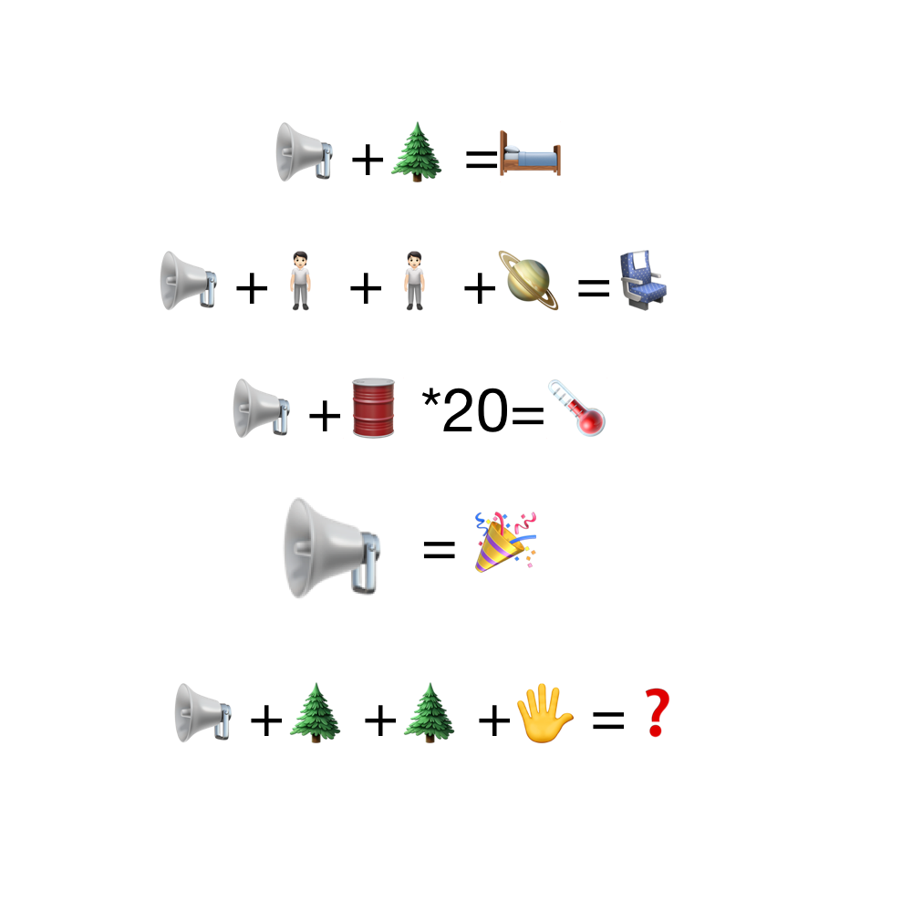

# 千字谜子题 157

## 题面

## 答案

`摩`

## 解析

床 = 广 + 木
座 = 广 + 人 + 人 + 土
度 = 广 + 又*20
庆 = 广 + 大
摩 = 广 + 木 + 木 + 手

## 本地附件

- [9bc2b90ac8ed4229a5a6fa9f427afd7f.webp](../../../assets/static.cipherpuzzles.com/static/images/9bc2b90ac8ed4229a5a6fa9f427afd7f.webp)

来源：[https://ccbc16.cipherpuzzles.com/data/c16-qian-puzzle.json#cid=157](https://ccbc16.cipherpuzzles.com/data/c16-qian-puzzle.json#cid=157)
