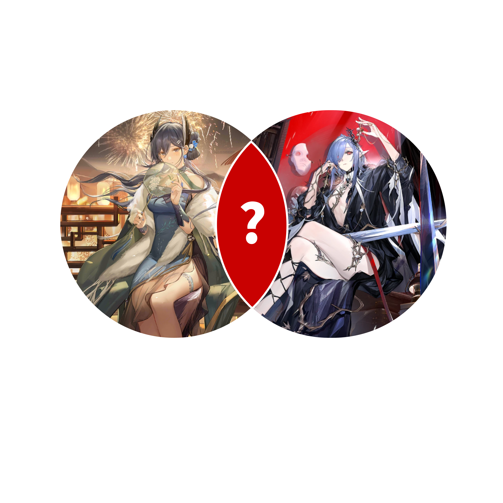

# 千字谜子题 158

## 题面

## 答案

`歌`

## 解析

两个角色都是明日方舟的干员
左边是【晓歌】右边是【歌蕾蒂娅】
因此二者的交集就是【歌】

## 本地附件

- [d52bf861e0e24f61adf7088a42e9355a.webp](../../../assets/static.cipherpuzzles.com/static/images/d52bf861e0e24f61adf7088a42e9355a.webp)

来源：[https://ccbc16.cipherpuzzles.com/data/c16-qian-puzzle.json#cid=158](https://ccbc16.cipherpuzzles.com/data/c16-qian-puzzle.json#cid=158)
