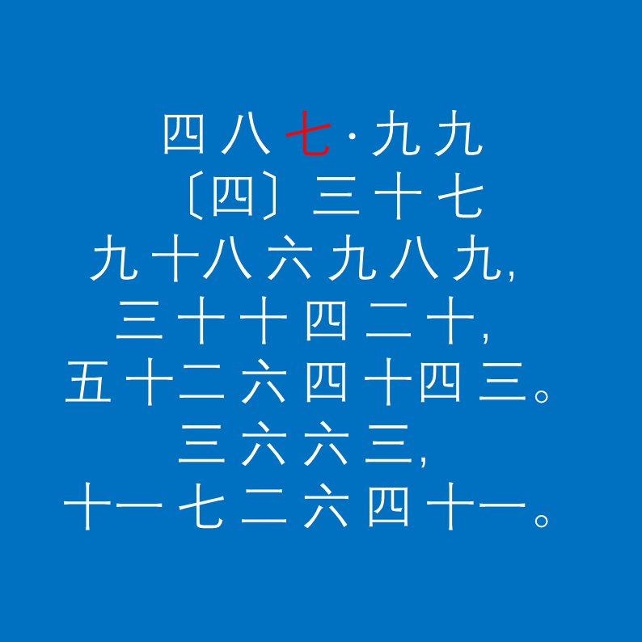

# 千字谜子题 16

## 题面

## 答案

`沙`

## 解析

_官方存档未填写解析。_

## 本地附件

- [57c7040340ad4e068ba6a4fc8a6afea6.webp](../../../assets/static.cipherpuzzles.com/static/images/57c7040340ad4e068ba6a4fc8a6afea6.webp)

来源：[https://ccbc16.cipherpuzzles.com/data/c16-qian-puzzle.json#cid=16](https://ccbc16.cipherpuzzles.com/data/c16-qian-puzzle.json#cid=16)
