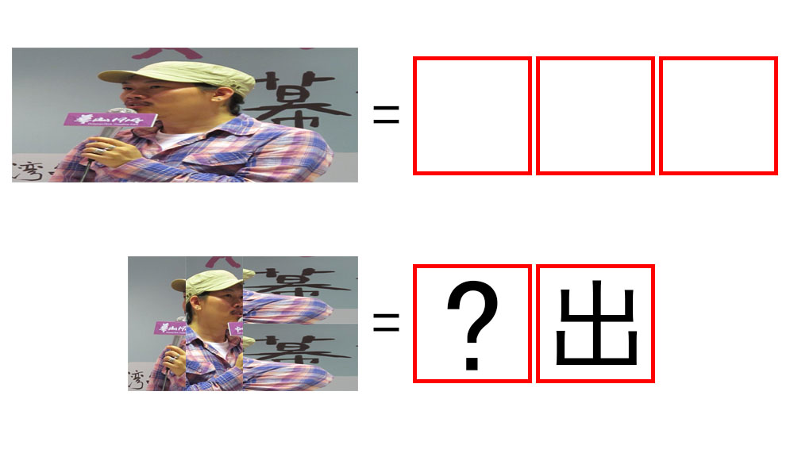

# 千字谜子题 161

## 题面

## 答案

`放`

## 解析

由上半部分可知每个框代表一个文字，经搜索可得知上半部分答案为“方文山”。
下半部分右边对应“出”可推测是部件排列得到字。注意到”文“反转没有意义，而反文有“攵”（反文旁），有方+攵=放，可知“？”处为“放”。

## 本地附件

- [0aecd176e3c54ebe8247dc089a23fb81.webp](../../../assets/static.cipherpuzzles.com/static/images/0aecd176e3c54ebe8247dc089a23fb81.webp)

来源：[https://ccbc16.cipherpuzzles.com/data/c16-qian-puzzle.json#cid=161](https://ccbc16.cipherpuzzles.com/data/c16-qian-puzzle.json#cid=161)
