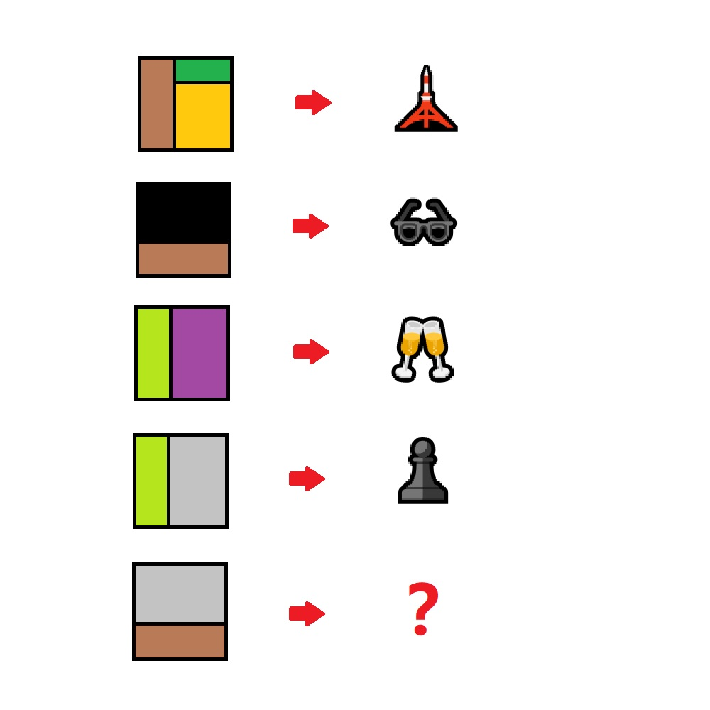

# 千字谜子题 162

## 题面

## 答案

`基`

## 解析

第一个字是塔，第二个字是墨，第三个字是杯，第四个字是棋，第五个字是基

## 本地附件

- [edbf8407a163498e8f666530efb6a6ed.webp](../../../assets/static.cipherpuzzles.com/static/images/edbf8407a163498e8f666530efb6a6ed.webp)

来源：[https://ccbc16.cipherpuzzles.com/data/c16-qian-puzzle.json#cid=162](https://ccbc16.cipherpuzzles.com/data/c16-qian-puzzle.json#cid=162)
