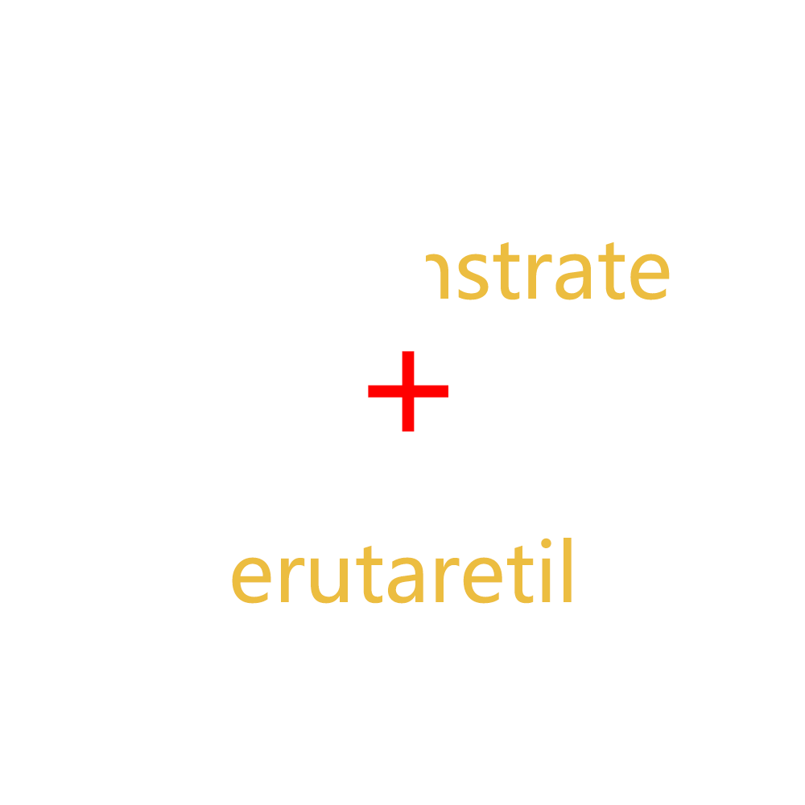

# 千字谜子题 163

## 题面

## 答案

`政`

## 解析

demonstrate = 证，取右半边正
erutaretil为literature逆置，为反文
合起来为政

## 本地附件

- [61d5240724ab4f47b8fc8b82e8e87b5e.webp](../../../assets/static.cipherpuzzles.com/static/images/61d5240724ab4f47b8fc8b82e8e87b5e.webp)

来源：[https://ccbc16.cipherpuzzles.com/data/c16-qian-puzzle.json#cid=163](https://ccbc16.cipherpuzzles.com/data/c16-qian-puzzle.json#cid=163)
