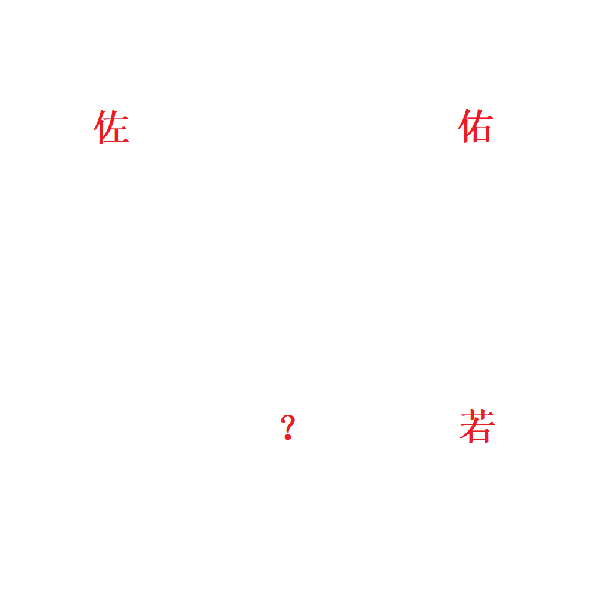

# 千字谜子题 164

## 题面

## 答案

`英`

## 解析

可以看到同一行字在左边就有左，在右边就有右。所以推理得到下面一行问号是草字头的字，同时“若”中的右变成表示中间的字。只有英是合理的字，所以答案是英。

## 本地附件

- [79d5f27f1fbf43b79d76b3d52dd13fde.webp](../../../assets/static.cipherpuzzles.com/static/images/79d5f27f1fbf43b79d76b3d52dd13fde.webp)

来源：[https://ccbc16.cipherpuzzles.com/data/c16-qian-puzzle.json#cid=164](https://ccbc16.cipherpuzzles.com/data/c16-qian-puzzle.json#cid=164)
