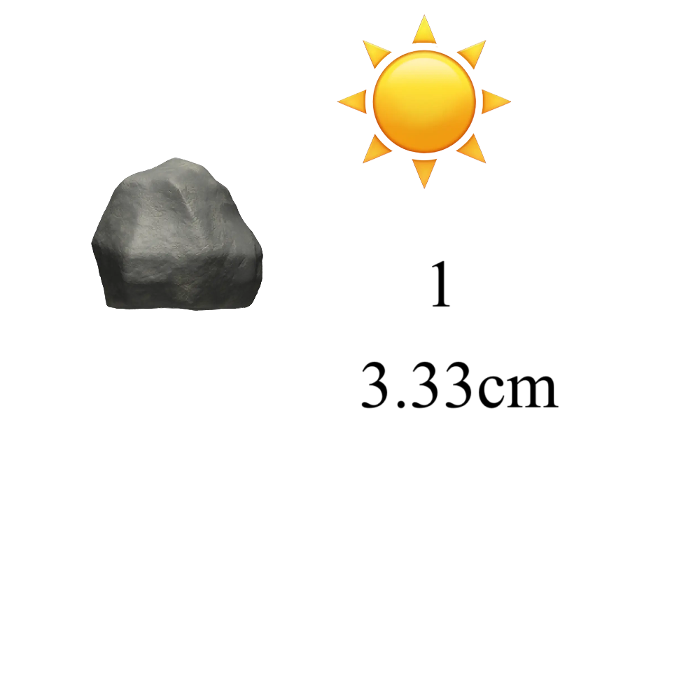

# 千字谜子题 165

## 题面

## 答案

`碍`

## 解析

将图片中的Emoji和数字转化为汉字部件：石、日、一、寸，组合可得答案“碍”。

## 本地附件

- [83d1dff05dde49a6a03c0a1c30036936.webp](../../../assets/static.cipherpuzzles.com/static/images/83d1dff05dde49a6a03c0a1c30036936.webp)

来源：[https://ccbc16.cipherpuzzles.com/data/c16-qian-puzzle.json#cid=165](https://ccbc16.cipherpuzzles.com/data/c16-qian-puzzle.json#cid=165)
