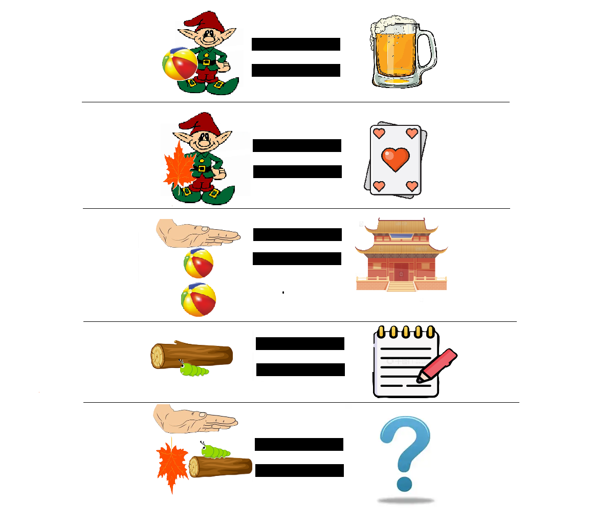

# 千字谜子题 168

## 题面

## 答案

`寐`

## 解析

修改：根据审核意见，将代表“宀”的伞换成了平摊的手（平铺且更符合“拍球”的意象），第三行左边的口换成一上一下（且下面的球略大），代表“-”的白线换成了小虫。

解析（改）：等式左边的卡通图片是构成文字的一部分，等式右边则是对应文字的含义。其中左侧：小矮人对应“卑”，皮球对应“口”，树叶对应“片”，手对应“宀”，木头对应“木”，小虫对应“-”；右侧简笔画分别为：啤，牌，宫，本。最终答案由“宀”，翻转的“片”即“爿”，“-”在“木”上即未，三部分构成。

## 本地附件

- [8ccd6a5dd0ec4d949b0217ce45deedaa.webp](../../../assets/static.cipherpuzzles.com/static/images/8ccd6a5dd0ec4d949b0217ce45deedaa.webp)

来源：[https://ccbc16.cipherpuzzles.com/data/c16-qian-puzzle.json#cid=168](https://ccbc16.cipherpuzzles.com/data/c16-qian-puzzle.json#cid=168)
