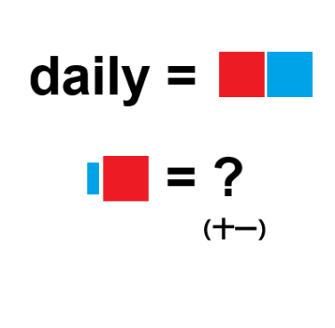

# 千字谜子题 169

## 题面

## 答案

`晦`

## 解析

daily=每日，将其反转得到日每=晦

## 本地附件

- [11697b325e0d42089fc593b5ef073212.webp](../../../assets/static.cipherpuzzles.com/static/images/11697b325e0d42089fc593b5ef073212.webp)

来源：[https://ccbc16.cipherpuzzles.com/data/c16-qian-puzzle.json#cid=169](https://ccbc16.cipherpuzzles.com/data/c16-qian-puzzle.json#cid=169)
