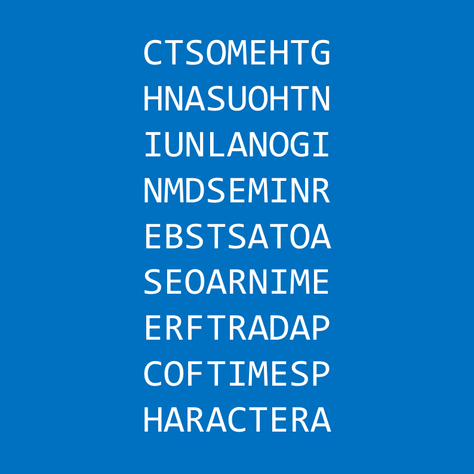

# 千字谜子题 17

## 题面

## 答案

`增`

## 解析

_官方存档未填写解析。_

## 本地附件

- [50c469219af34931bf8db4f667033111.webp](../../../assets/static.cipherpuzzles.com/static/images/50c469219af34931bf8db4f667033111.webp)

来源：[https://ccbc16.cipherpuzzles.com/data/c16-qian-puzzle.json#cid=17](https://ccbc16.cipherpuzzles.com/data/c16-qian-puzzle.json#cid=17)
