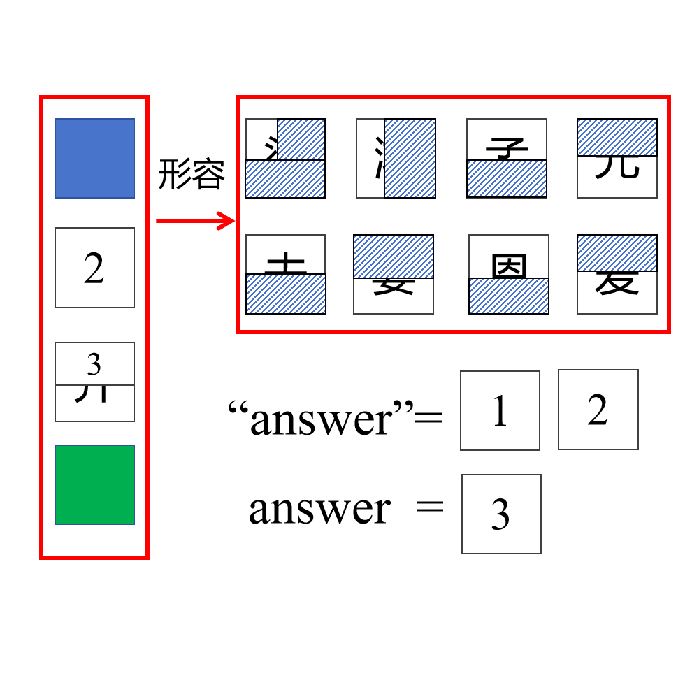

# 千字谜子题 170

## 题面

## 答案

`文`

## 解析

左侧红色方块内容为“举案齐眉”
右侧红色方块内容为“举案齐眉”的释义，去除遮挡后的内容为“梁鸿孟光夫妻恩爱”
“answer”意为“答案”提示方块2的内容，
answer指向真正的答案“文”字

## 本地附件

- [da1cd29fa3d843379dac9fcfd070b6eb.webp](../../../assets/static.cipherpuzzles.com/static/images/da1cd29fa3d843379dac9fcfd070b6eb.webp)

来源：[https://ccbc16.cipherpuzzles.com/data/c16-qian-puzzle.json#cid=170](https://ccbc16.cipherpuzzles.com/data/c16-qian-puzzle.json#cid=170)
