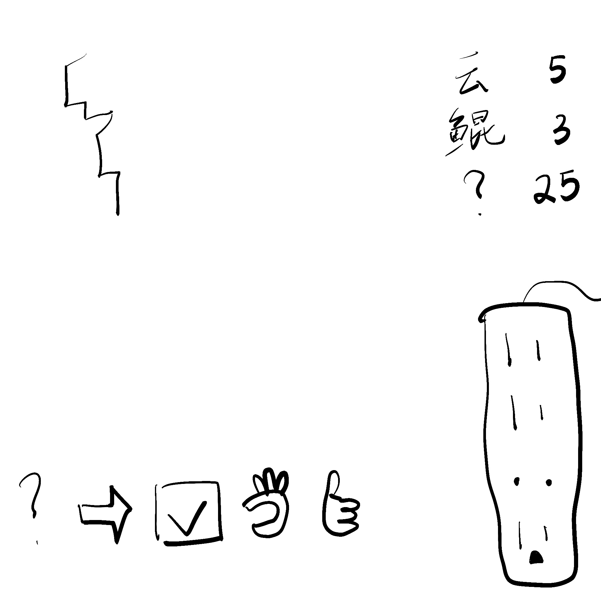

# 千字谜子题 171

## 题面

## 答案

`以`

## 解析

四道题是序章其中四道题目。
左上角：一笔画 “所”字
左下角：emoji “可”
右上角： 逍遥游中出现了25次的字是“为”
右下角：AACB -> 1132， 是“太”的汉字电码

左边的字都可以在右边加“以”组词，右边的字都可以在左边加“以”组词
最终答案：以

## 本地附件

- [a921c85da13f491ab07b5746830c07d8.webp](../../../assets/static.cipherpuzzles.com/static/images/a921c85da13f491ab07b5746830c07d8.webp)

来源：[https://ccbc16.cipherpuzzles.com/data/c16-qian-puzzle.json#cid=171](https://ccbc16.cipherpuzzles.com/data/c16-qian-puzzle.json#cid=171)
