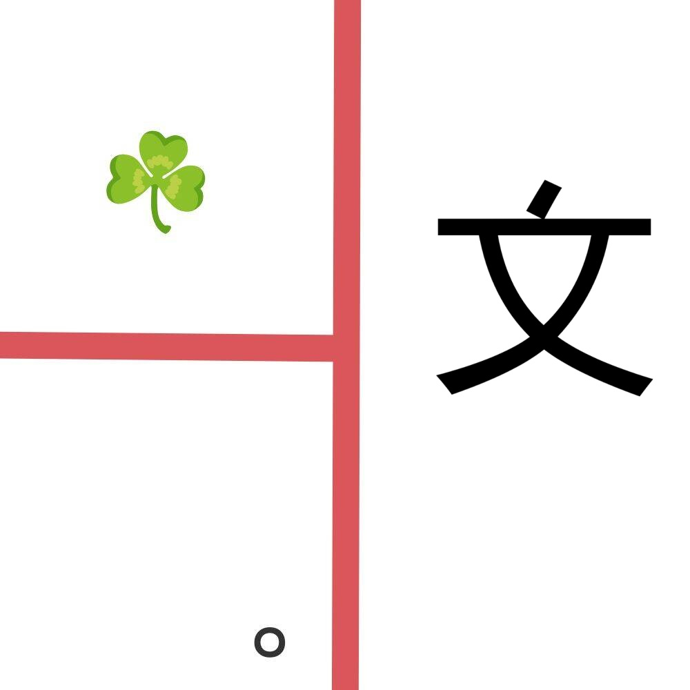

# 千字谜子题 172

## 题面

## 答案

`敬`

## 解析

草的emoji代表草字头，句号代表“句”，一个左右反转的“文”代表反文，再放入图片对应的位置，得到“敬”

## 本地附件

- [ce37df45bd534c06a6ba1f9a6b04e0fe.webp](../../../assets/static.cipherpuzzles.com/static/images/ce37df45bd534c06a6ba1f9a6b04e0fe.webp)

来源：[https://ccbc16.cipherpuzzles.com/data/c16-qian-puzzle.json#cid=172](https://ccbc16.cipherpuzzles.com/data/c16-qian-puzzle.json#cid=172)
