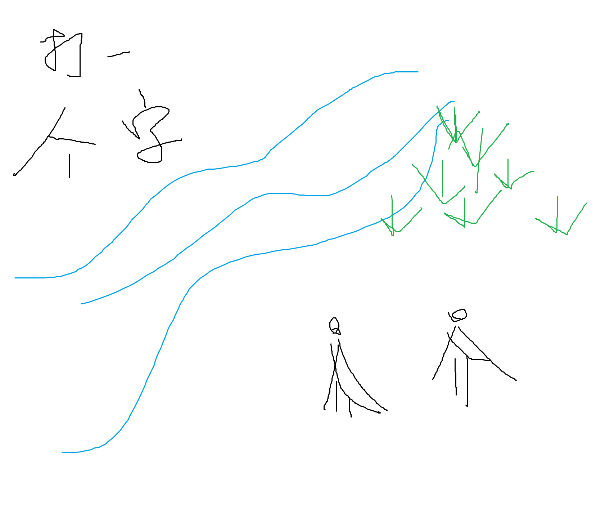

# 千字谜子题 173

## 题面

## 答案

`满`

## 解析

有点过于简单了

## 本地附件

- [e484b1e5d8114a6ab686fe34fc8c0567.webp](../../../assets/static.cipherpuzzles.com/static/images/e484b1e5d8114a6ab686fe34fc8c0567.webp)

来源：[https://ccbc16.cipherpuzzles.com/data/c16-qian-puzzle.json#cid=173](https://ccbc16.cipherpuzzles.com/data/c16-qian-puzzle.json#cid=173)
