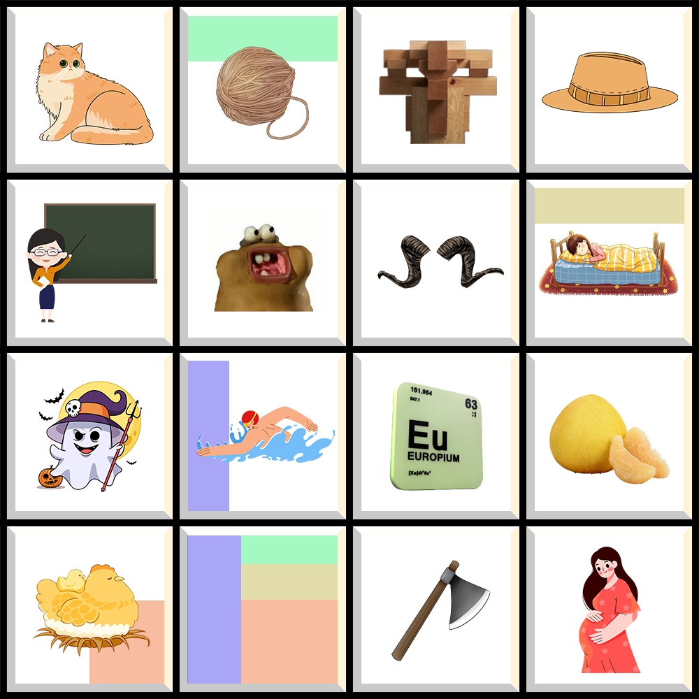

# 千字谜子题 174

## 题面

## 答案

`浮`

## 解析

每一行代表一个音，第一行是mao，第二行是shui，第三行是you，第四行是fu，然后每一列是四个读音，从一声到四声；每个方格里是一个字，依次是：猫、毛（线）、（榫）卯、帽（子）、教、嚼（口香糖）、（牛）角、（睡）觉、幽（灵）、游（泳）、铕、柚（子）、孵（化）、浮！、斧（头）、(孕)妇，最终按照彩块里拼起来，就是每个字对应拆出来的部分拼成的“浮”

## 本地附件

- [e423381d97524aeaa2cfc1ee1b80f1ac.webp](../../../assets/static.cipherpuzzles.com/static/images/e423381d97524aeaa2cfc1ee1b80f1ac.webp)

来源：[https://ccbc16.cipherpuzzles.com/data/c16-qian-puzzle.json#cid=174](https://ccbc16.cipherpuzzles.com/data/c16-qian-puzzle.json#cid=174)
