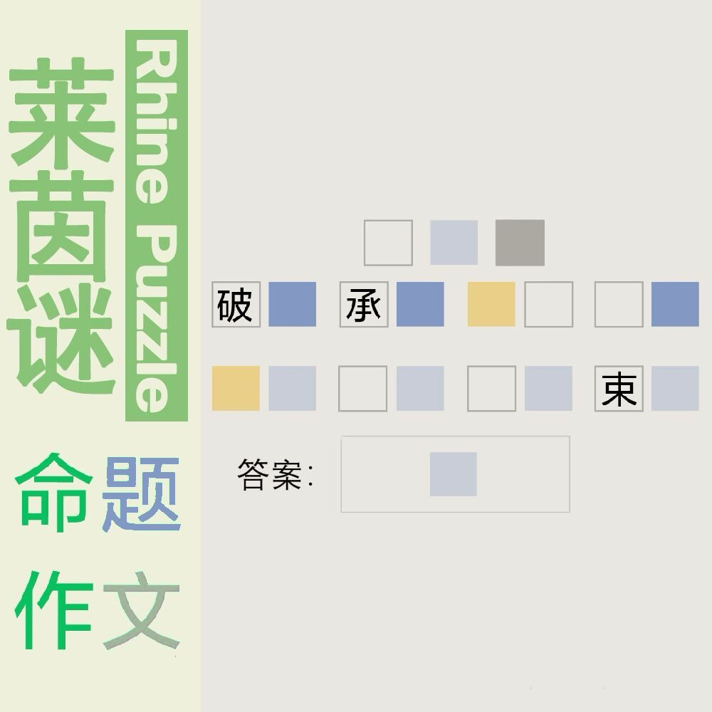

# 千字谜子题 175

## 题面

## 答案

`股`

## 解析

八股文的八个部分：“破题”、“承题”、“起讲”、“入题”、“起股”、“中股”、“后股”、“束股”

## 本地附件

- [0688b00272fa412f9d2294898273abef.webp](../../../assets/static.cipherpuzzles.com/static/images/0688b00272fa412f9d2294898273abef.webp)

来源：[https://ccbc16.cipherpuzzles.com/data/c16-qian-puzzle.json#cid=175](https://ccbc16.cipherpuzzles.com/data/c16-qian-puzzle.json#cid=175)
