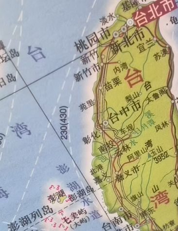

# 千字谜子题 176

## 题面

## 答案

`治`

## 解析

左边是水  右边是台  合起来是治

## 本地附件

- [f4b482eb51744e1191cb2425674e6a7a.webp](../../../assets/static.cipherpuzzles.com/static/images/f4b482eb51744e1191cb2425674e6a7a.webp)

来源：[https://ccbc16.cipherpuzzles.com/data/c16-qian-puzzle.json#cid=176](https://ccbc16.cipherpuzzles.com/data/c16-qian-puzzle.json#cid=176)
