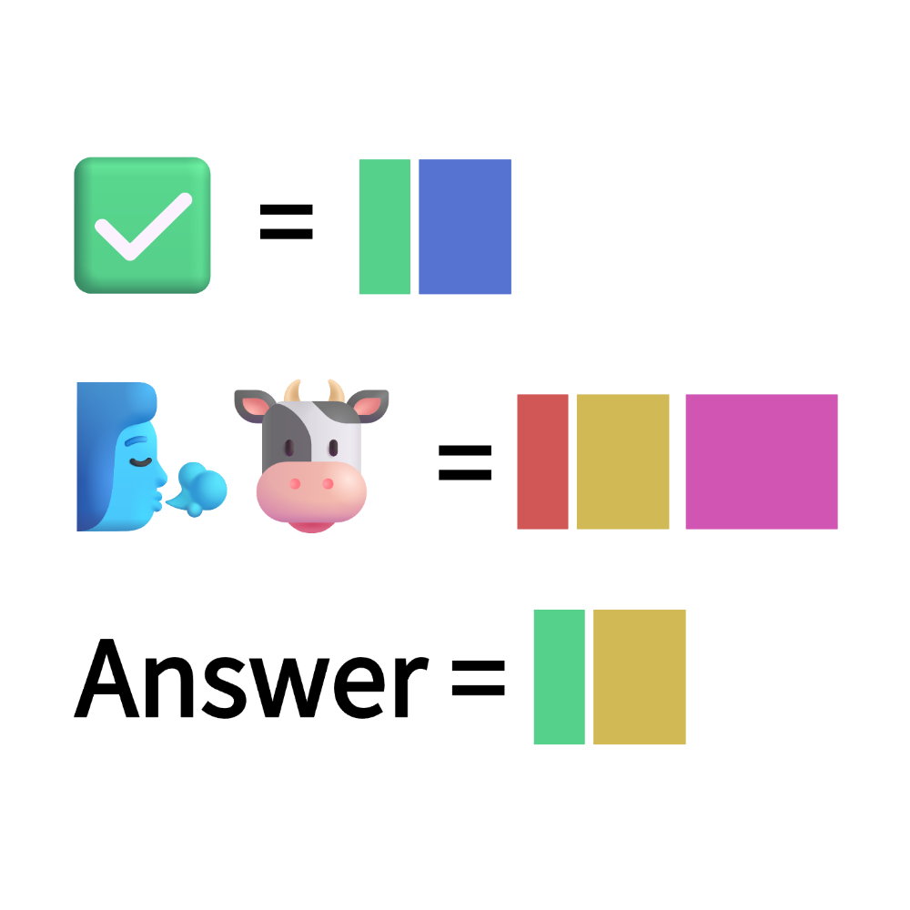

# 千字谜子题 177

## 题面

## 答案

`欢`

## 解析

提取“对”的左半部分和“吹牛”中“吹”的右半部分，组合得到欢。

## 本地附件

- [afeff3166d5e424285b1d47ce92e2eeb.webp](../../../assets/static.cipherpuzzles.com/static/images/afeff3166d5e424285b1d47ce92e2eeb.webp)

来源：[https://ccbc16.cipherpuzzles.com/data/c16-qian-puzzle.json#cid=177](https://ccbc16.cipherpuzzles.com/data/c16-qian-puzzle.json#cid=177)
