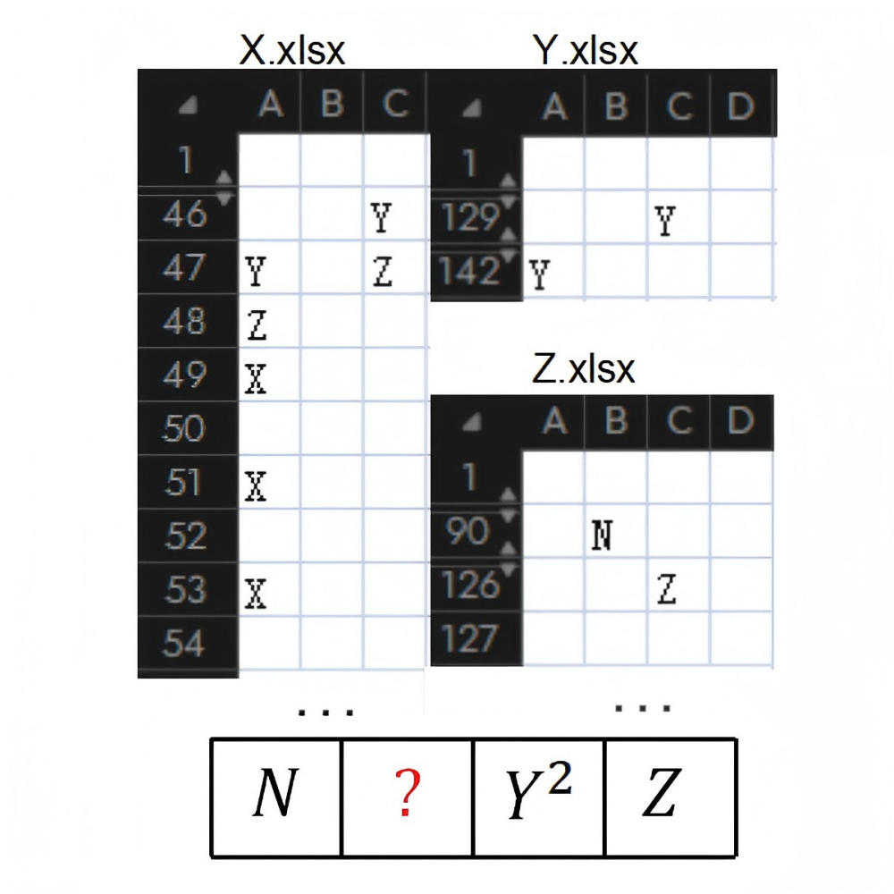

# 千字谜子题 178

## 题面

## 答案

`象`

## 解析

灵感来源（这不算抄的吧。。。）：
前几个月某次城市探索解谜有一次用到传统蒙学三大读物，印象挺深的，好像之前puzzlehunt也有过类似的题。

解析：
传统蒙学三大读物《三字经》《百家姓》《千字文》主打三、百、千三个数字，分别对应图中的X.xlsx，Y.xlsx，Z.xlsx，三、百、千即表格中的X, Y, Z。相信连立邦漆和日本国都能联系起来的CCBC玩家看到这三个图不难想到XYZ是什么，透过表格中XYZ位置也可以互相验证。
进而在千字文里找到N对应的汉字是“气”，于是下方红色问号对应的答案不难想到是

## 本地附件

- [1813585dc23a4512b93348548184c050.webp](../../../assets/static.cipherpuzzles.com/static/images/1813585dc23a4512b93348548184c050.webp)

来源：[https://ccbc16.cipherpuzzles.com/data/c16-qian-puzzle.json#cid=178](https://ccbc16.cipherpuzzles.com/data/c16-qian-puzzle.json#cid=178)
