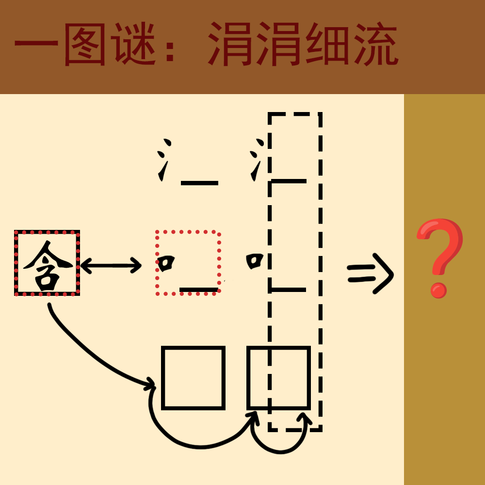

# 千字谜子题 179

## 题面

## 答案

`永`

## 解析

一、二两行为两个相同偏旁部首的字
第二行“含”可以转化为“吟”，组词“吟咏”
第三行“含BCC”可以提取出“含情脉脉”
第一行的“游泳”可用于辅助验证
提取出相同部分“永”
（同时题目“涓涓细流”拆成“氵口月”暗示永的三个部首）

## 本地附件

- [f5cac618465d46f5b94212ff471a6da9.webp](../../../assets/static.cipherpuzzles.com/static/images/f5cac618465d46f5b94212ff471a6da9.webp)

来源：[https://ccbc16.cipherpuzzles.com/data/c16-qian-puzzle.json#cid=179](https://ccbc16.cipherpuzzles.com/data/c16-qian-puzzle.json#cid=179)
