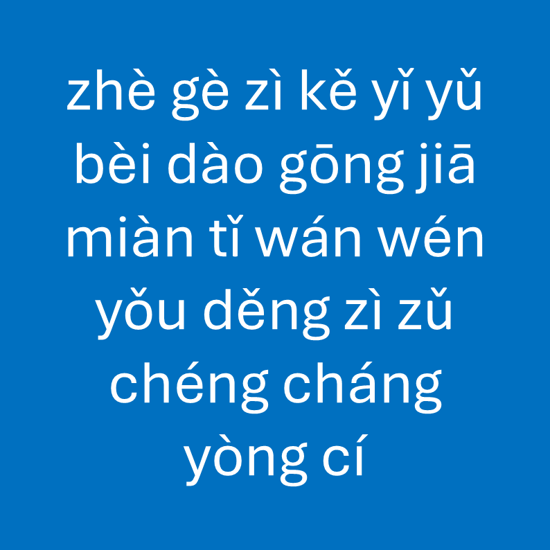

# 千字谜子题 18

## 题面

## 答案

`具`

## 解析

_官方存档未填写解析。_

## 本地附件

- [08f6c410cab5476e966f877f7f6f2b03.webp](../../../assets/static.cipherpuzzles.com/static/images/08f6c410cab5476e966f877f7f6f2b03.webp)

来源：[https://ccbc16.cipherpuzzles.com/data/c16-qian-puzzle.json#cid=18](https://ccbc16.cipherpuzzles.com/data/c16-qian-puzzle.json#cid=18)
