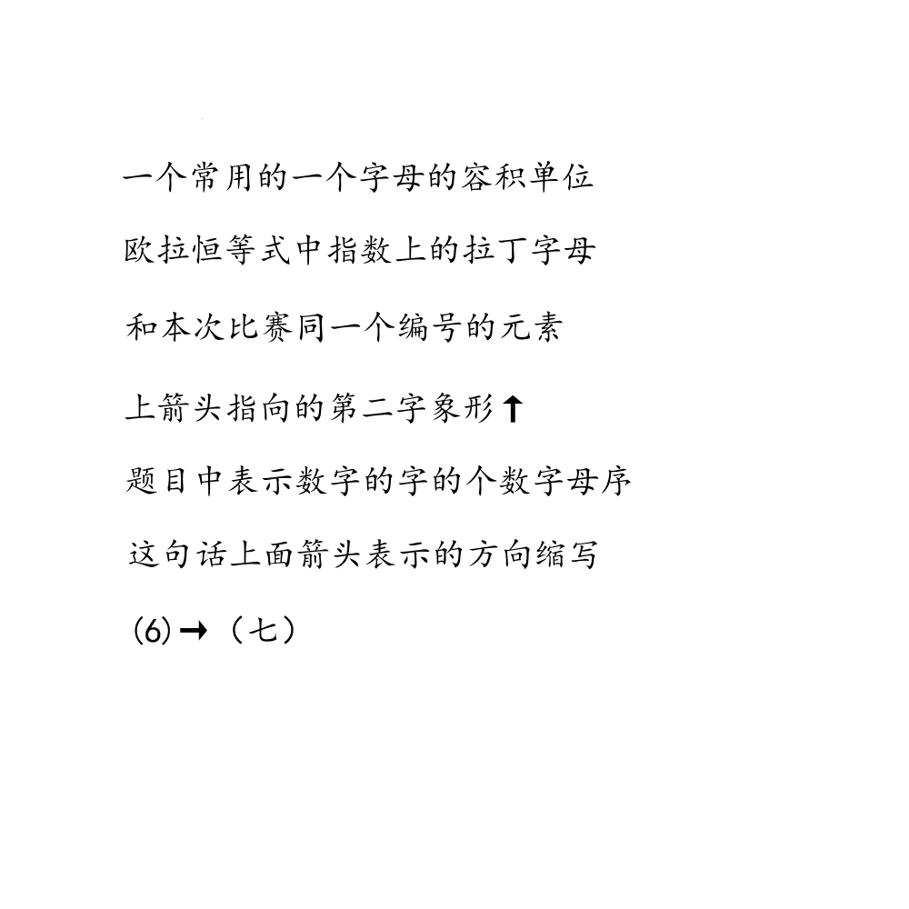

# 千字谜子题 181

## 题面

## 答案

`听`

## 解析

1.常用容积单位升L
2.e^iπ+1=0，其中i是拉丁字母，π是希腊字母
3.本次比赛编号16，对应元素即为硫S
4.上箭头指向的第二个字是丁，象形T
5.第1题有两个“一”，第3题有一个“一”，第4题有一个“二”，最后提取有一个“七”，一共5个字（注意甲乙丙丁和阿拉伯数字不属于这里的“表示数字的字”），按字母序（即a1z26）即为e
6.这句话上面的箭头是上箭头，指向北，缩写为N
六道题答案listen，提取一个七笔汉字即为“听”

## 本地附件

- [adff12fc8cc444c7a0a55c2ad4f90725.webp](../../../assets/static.cipherpuzzles.com/static/images/adff12fc8cc444c7a0a55c2ad4f90725.webp)

来源：[https://ccbc16.cipherpuzzles.com/data/c16-qian-puzzle.json#cid=181](https://ccbc16.cipherpuzzles.com/data/c16-qian-puzzle.json#cid=181)
