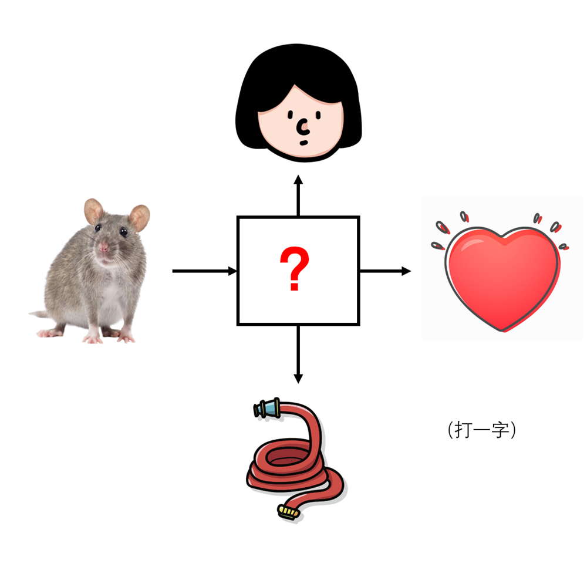

# 千字谜子题 182

## 题面

## 答案

`尽`

## 解析

题目是一个猜一个中文字的谜题，上下左右的图像分别是头、管、耗、心，分别可与“尽”字组词为尽头、尽管、耗尽、尽心，可得出问号对应的字是“尽”字。

## 本地附件

- [73613c0cfdac444ba9a483598a0bd28c.webp](../../../assets/static.cipherpuzzles.com/static/images/73613c0cfdac444ba9a483598a0bd28c.webp)

来源：[https://ccbc16.cipherpuzzles.com/data/c16-qian-puzzle.json#cid=182](https://ccbc16.cipherpuzzles.com/data/c16-qian-puzzle.json#cid=182)
