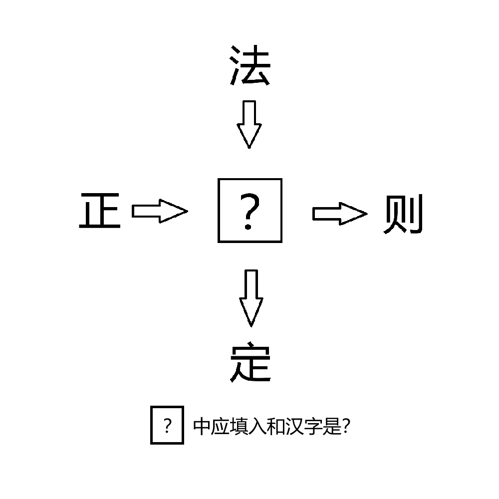

# 千字谜子题 183

## 题面

## 答案

`规`

## 解析

正规、法规、规则、规定。
改成中文牺牲掉了对称性，但是保证了简体。

## 本地附件

- [56e7bf33f72a4a7a91114755e48eef0e.webp](../../../assets/static.cipherpuzzles.com/static/images/56e7bf33f72a4a7a91114755e48eef0e.webp)

来源：[https://ccbc16.cipherpuzzles.com/data/c16-qian-puzzle.json#cid=183](https://ccbc16.cipherpuzzles.com/data/c16-qian-puzzle.json#cid=183)
