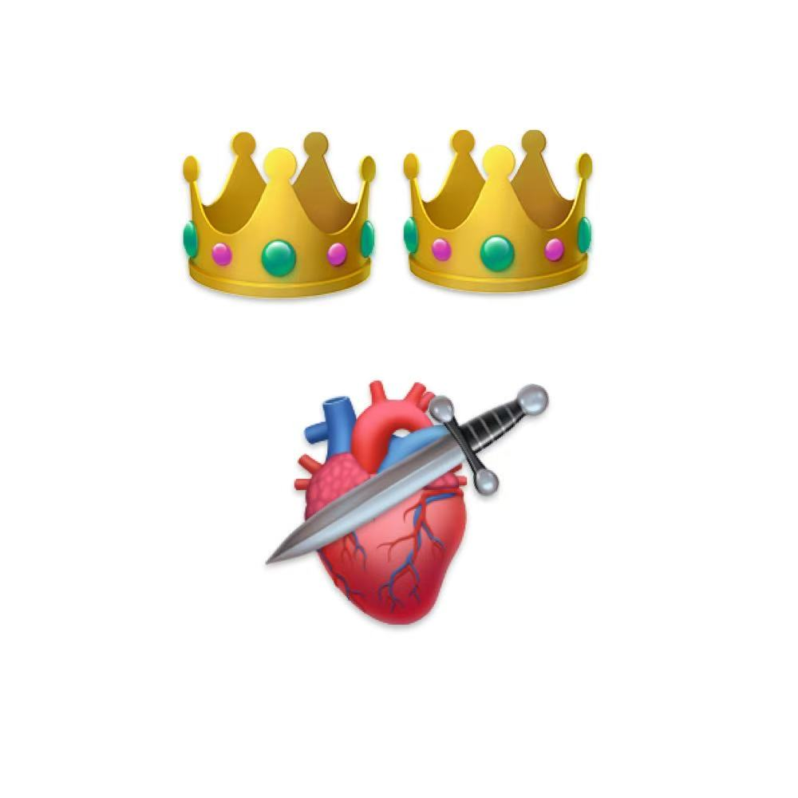

# 千字谜子题 184

## 题面

## 答案

`瑟`

## 解析

皇冠=王 心脏=心 匕首=斜撇

## 本地附件

- [a4e289b9882441a9b63aac82098f6aa6.webp](../../../assets/static.cipherpuzzles.com/static/images/a4e289b9882441a9b63aac82098f6aa6.webp)

来源：[https://ccbc16.cipherpuzzles.com/data/c16-qian-puzzle.json#cid=184](https://ccbc16.cipherpuzzles.com/data/c16-qian-puzzle.json#cid=184)
