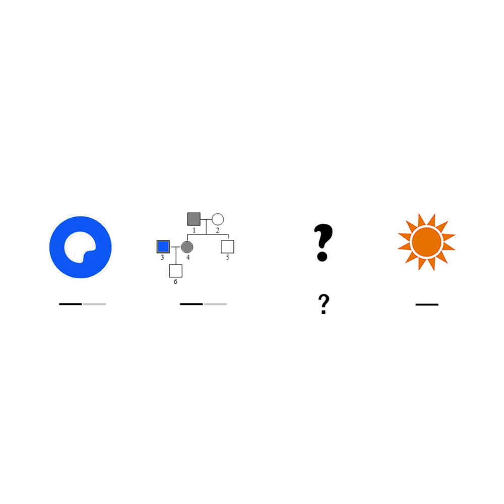

# 千字谜子题 185

## 题面

## 答案

`逐`

## 解析

第一个字
夸克 取第一个字 夸
第二个字
（遗传树）父亲 取第一个字 父
第四个字
日
想到神话“夸父逐日”
所以问号是一个追逐的图案
和汉字答案“逐”

## 本地附件

- [b7e1190618364e01ae44e6c2b27009a7.webp](../../../assets/static.cipherpuzzles.com/static/images/b7e1190618364e01ae44e6c2b27009a7.webp)

来源：[https://ccbc16.cipherpuzzles.com/data/c16-qian-puzzle.json#cid=185](https://ccbc16.cipherpuzzles.com/data/c16-qian-puzzle.json#cid=185)
