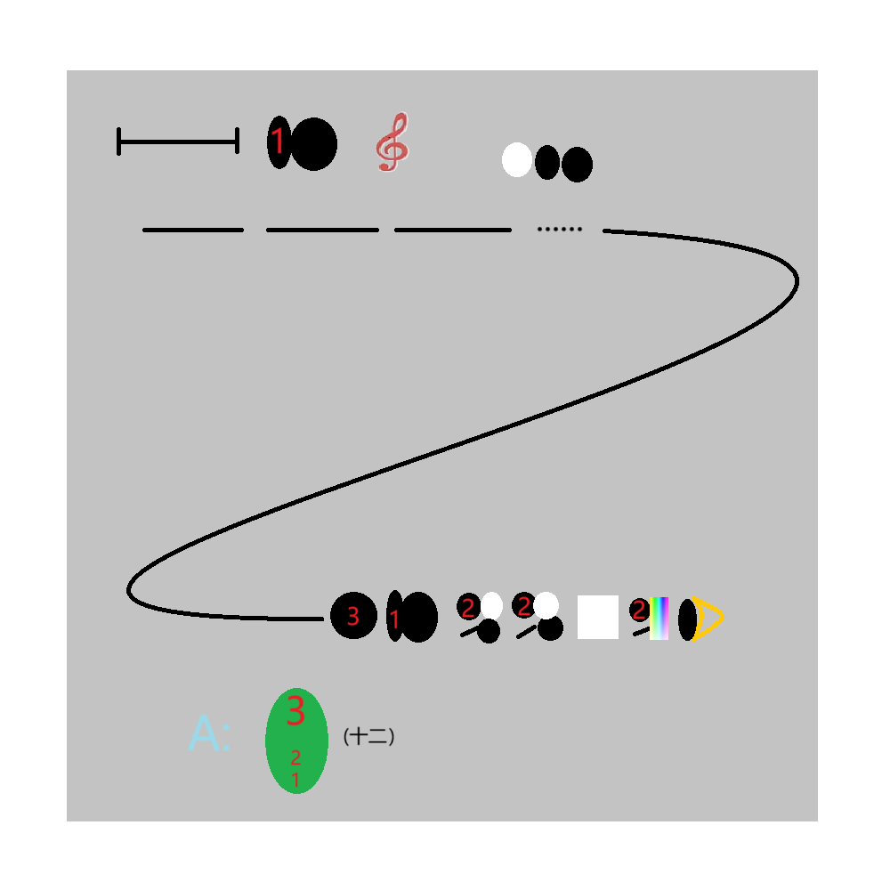

# 千字谜子题 186

## 题面

## 答案

`紫`

## 解析

左上角表示长恨歌，右上角表示白居易，整个图形指向最后一句“此恨绵绵无绝期”，答案以及给出的形状均为拼字构成（1是竖心旁，2是绞丝旁去掉最后一笔，3是‘此’）

## 本地附件

- [29e2098d9893427eac8d272ca5b0ab4e.webp](../../../assets/static.cipherpuzzles.com/static/images/29e2098d9893427eac8d272ca5b0ab4e.webp)

来源：[https://ccbc16.cipherpuzzles.com/data/c16-qian-puzzle.json#cid=186](https://ccbc16.cipherpuzzles.com/data/c16-qian-puzzle.json#cid=186)
