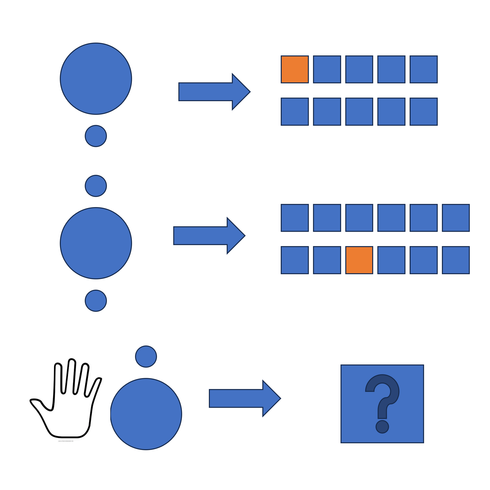

# 千字谜子题 187

## 题面

## 答案

`抽`

## 解析

大圆代表田，小圆代表突出的竖，前两字分别代表天干的甲和地支的申，答案是抽

## 本地附件

- [c1dd79d77e2b4c9a81f7ec0838e938b5.webp](../../../assets/static.cipherpuzzles.com/static/images/c1dd79d77e2b4c9a81f7ec0838e938b5.webp)

来源：[https://ccbc16.cipherpuzzles.com/data/c16-qian-puzzle.json#cid=187](https://ccbc16.cipherpuzzles.com/data/c16-qian-puzzle.json#cid=187)
