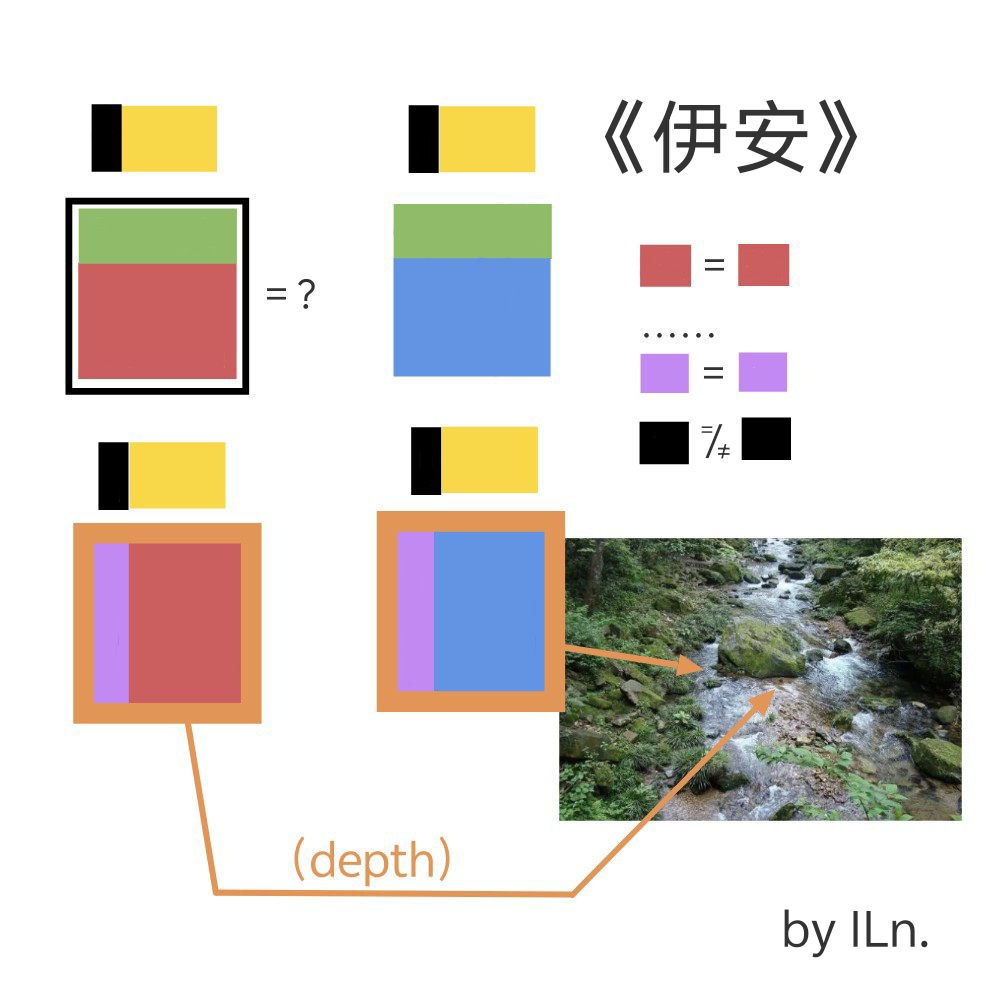

# 千字谜子题 188

## 题面

## 答案

`笺`

## 解析

每个色块（除黑色）代表的部分相同。
观察不难看出题内展示了四个汉字与其上的拼音，根据下方图中所指与色块间关系可得到四个字分别为笺、简、浅、涧。
同时标题“伊安”也提示了四个字共同的拼音部分“ian”。

## 本地附件

- [cafdacf70df544de970146b9a007838b.webp](../../../assets/static.cipherpuzzles.com/static/images/cafdacf70df544de970146b9a007838b.webp)

来源：[https://ccbc16.cipherpuzzles.com/data/c16-qian-puzzle.json#cid=188](https://ccbc16.cipherpuzzles.com/data/c16-qian-puzzle.json#cid=188)
