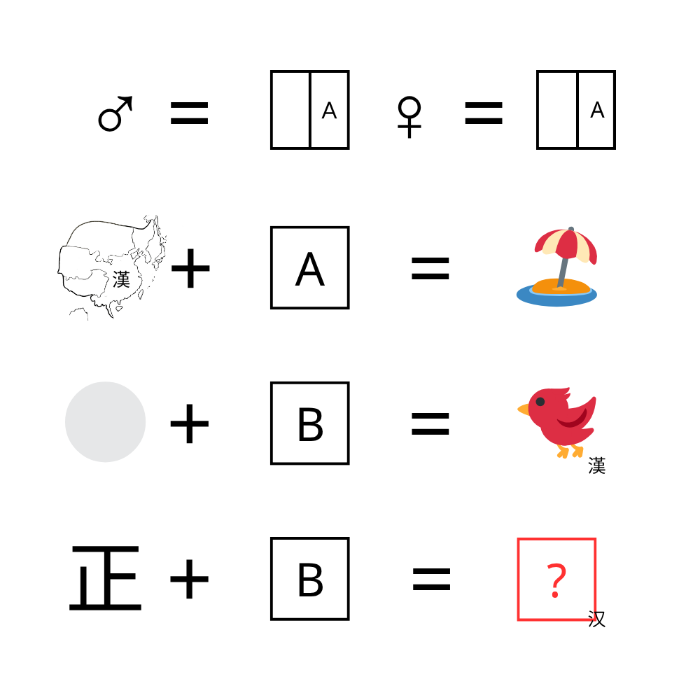

# 千字谜子题 189

## 题面

## 答案

`焉`

## 解析

雄 雌
汉（漢）+ 隹=滩（灘）
白+⿹⿺㇉一灬=鳥
正+ ⿹⿺㇉一灬=焉

## 本地附件

- [9223661b2edf41d780a90b3397751640.webp](../../../assets/static.cipherpuzzles.com/static/images/9223661b2edf41d780a90b3397751640.webp)

来源：[https://ccbc16.cipherpuzzles.com/data/c16-qian-puzzle.json#cid=189](https://ccbc16.cipherpuzzles.com/data/c16-qian-puzzle.json#cid=189)
