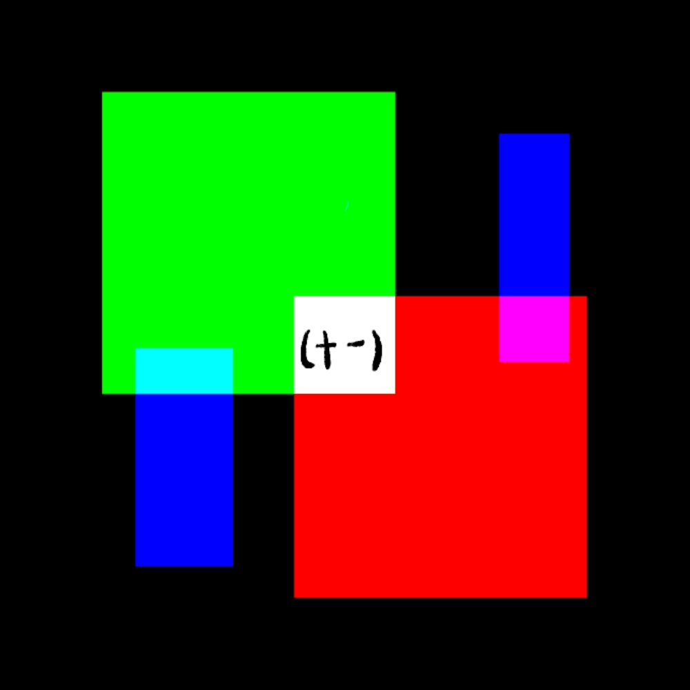

# 千字谜子题 190

## 题面

## 答案

`黄`

## 解析

光的三原色，绿光叠加红光为黄光。
蓝光与绿光红光相叠加作为提示
（十一）提示是一个十一画的汉字：黄。

## 本地附件

- [82cf27343240418baec5c558a2d52528.webp](../../../assets/static.cipherpuzzles.com/static/images/82cf27343240418baec5c558a2d52528.webp)

来源：[https://ccbc16.cipherpuzzles.com/data/c16-qian-puzzle.json#cid=190](https://ccbc16.cipherpuzzles.com/data/c16-qian-puzzle.json#cid=190)
