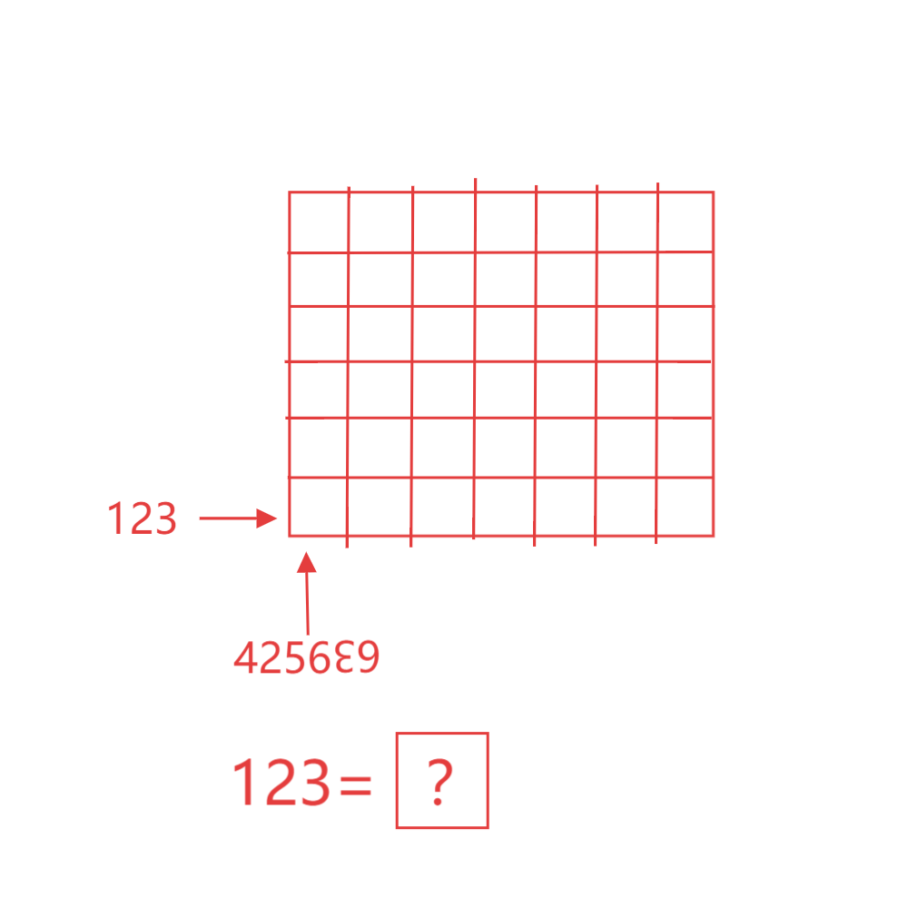

# 千字谜子题 192

## 题面

## 答案

`行`

## 解析

表格的行列为row，column，其中wm互为颠倒，un互为颠倒，利用颠倒数字表示，最后将row转化成中文“行”

## 本地附件

- [adaebe4be84443ccaf59e6718384705d.webp](../../../assets/static.cipherpuzzles.com/static/images/adaebe4be84443ccaf59e6718384705d.webp)

来源：[https://ccbc16.cipherpuzzles.com/data/c16-qian-puzzle.json#cid=192](https://ccbc16.cipherpuzzles.com/data/c16-qian-puzzle.json#cid=192)
