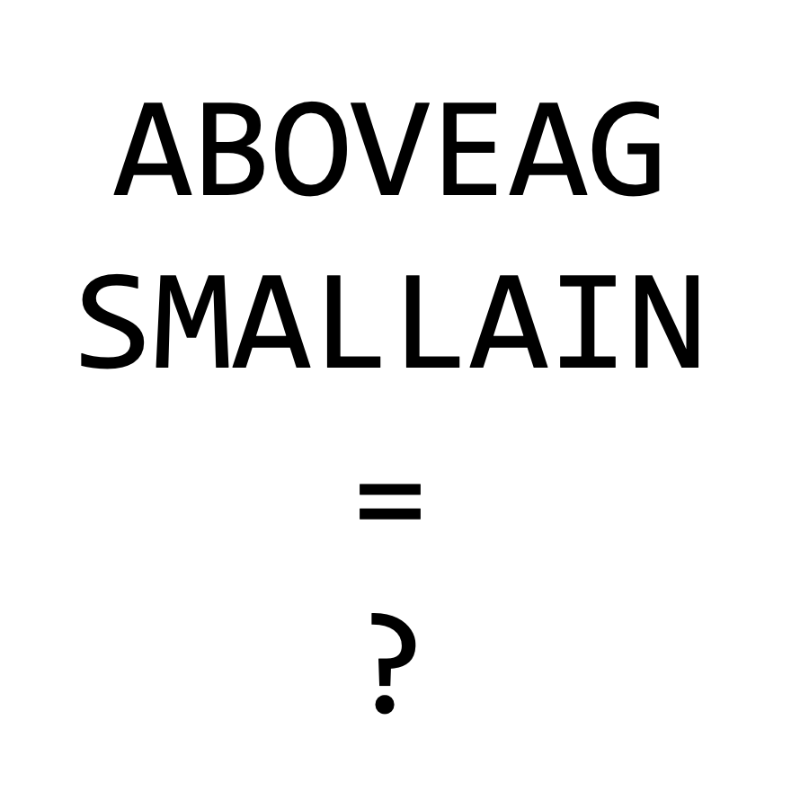

# 千字谜子题 193

## 题面

## 答案

`叔`

## 解析

此题为翻译题，注意到三个语素ABOVE，SMALL，和AGAIN可以被翻译为上、小、又，组合得到叔，令人忍俊不禁。

## 本地附件

- [d43a48a6efe04019a2ec128cf1fe352b.webp](../../../assets/static.cipherpuzzles.com/static/images/d43a48a6efe04019a2ec128cf1fe352b.webp)

来源：[https://ccbc16.cipherpuzzles.com/data/c16-qian-puzzle.json#cid=193](https://ccbc16.cipherpuzzles.com/data/c16-qian-puzzle.json#cid=193)
