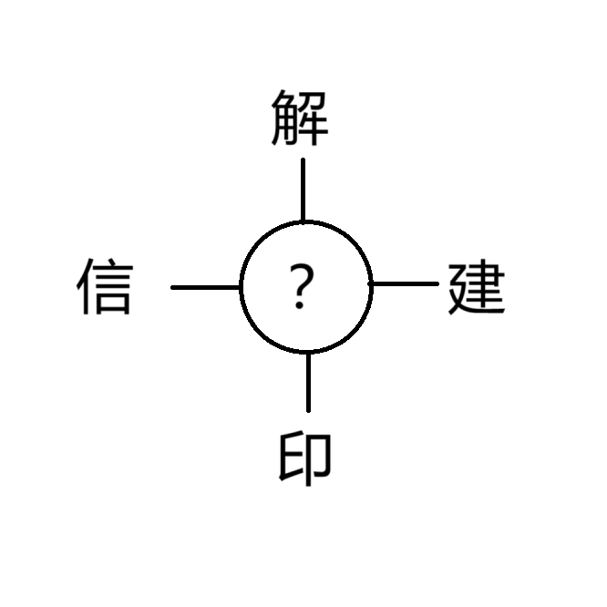

# 千字谜子题 194

## 题面

## 答案

`封`

## 解析

简单的字谜，找出可以和这四个字组词的汉字：解封，封印，信封，封建

## 本地附件

- [3b525cd51bb94e1a915323ffe2b19a57.webp](../../../assets/static.cipherpuzzles.com/static/images/3b525cd51bb94e1a915323ffe2b19a57.webp)

来源：[https://ccbc16.cipherpuzzles.com/data/c16-qian-puzzle.json#cid=194](https://ccbc16.cipherpuzzles.com/data/c16-qian-puzzle.json#cid=194)
