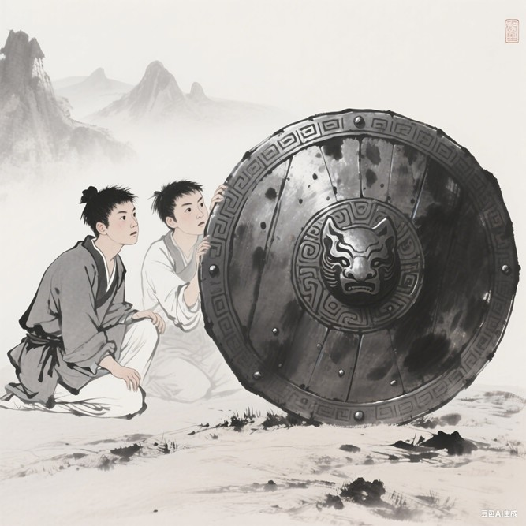

# 千字谜子题 195

## 题面

## 答案

`循`

## 解析

双人位于盾牌左侧，故为循（彳+盾）。
ps:图片由豆包ai生成

## 本地附件

- [fbe866089b6b4ed783f7a8433f635b86.webp](../../../assets/static.cipherpuzzles.com/static/images/fbe866089b6b4ed783f7a8433f635b86.webp)

来源：[https://ccbc16.cipherpuzzles.com/data/c16-qian-puzzle.json#cid=195](https://ccbc16.cipherpuzzles.com/data/c16-qian-puzzle.json#cid=195)
