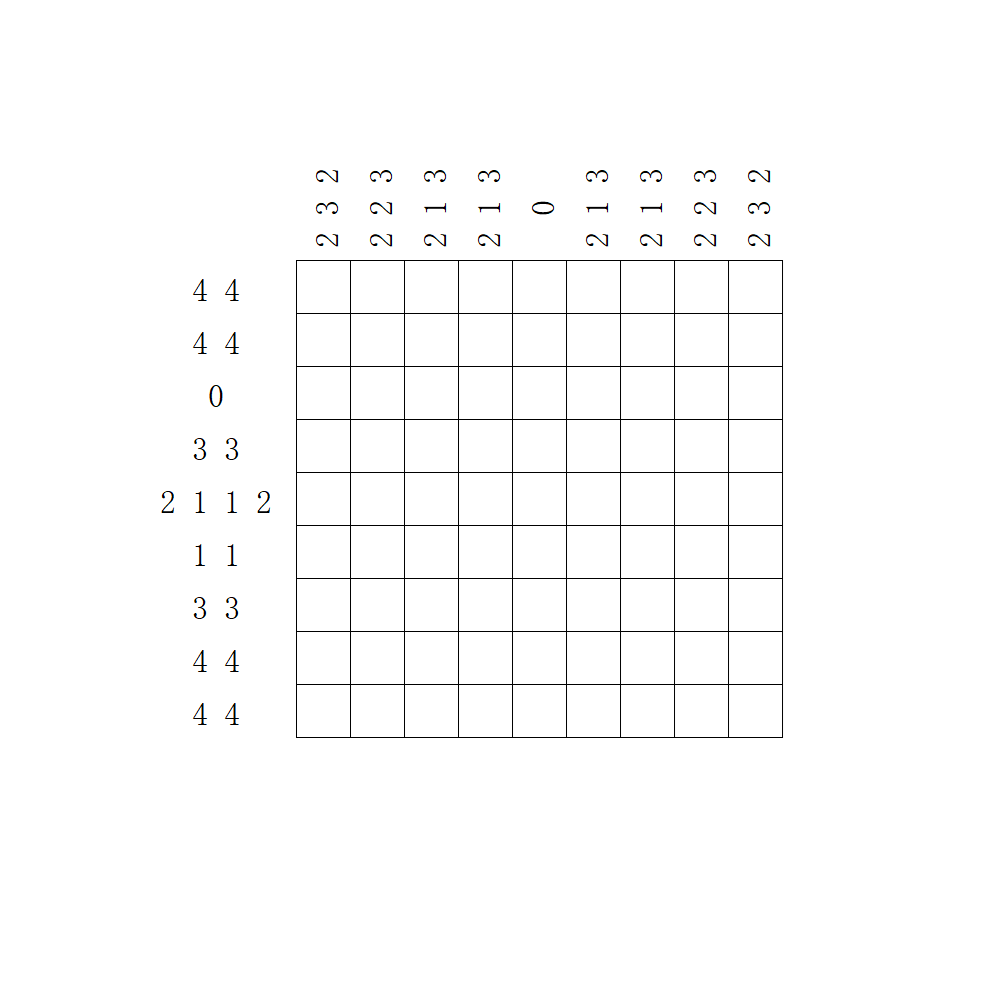

# 千字谜子题 196

## 题面

## 答案

`本`

## 解析

数织，填涂后通过未填涂的格子得到“本”

## 本地附件

- [9fa2ff6ce51c4830a5b114bee1dd3bc4.webp](../../../assets/static.cipherpuzzles.com/static/images/9fa2ff6ce51c4830a5b114bee1dd3bc4.webp)

来源：[https://ccbc16.cipherpuzzles.com/data/c16-qian-puzzle.json#cid=196](https://ccbc16.cipherpuzzles.com/data/c16-qian-puzzle.json#cid=196)
