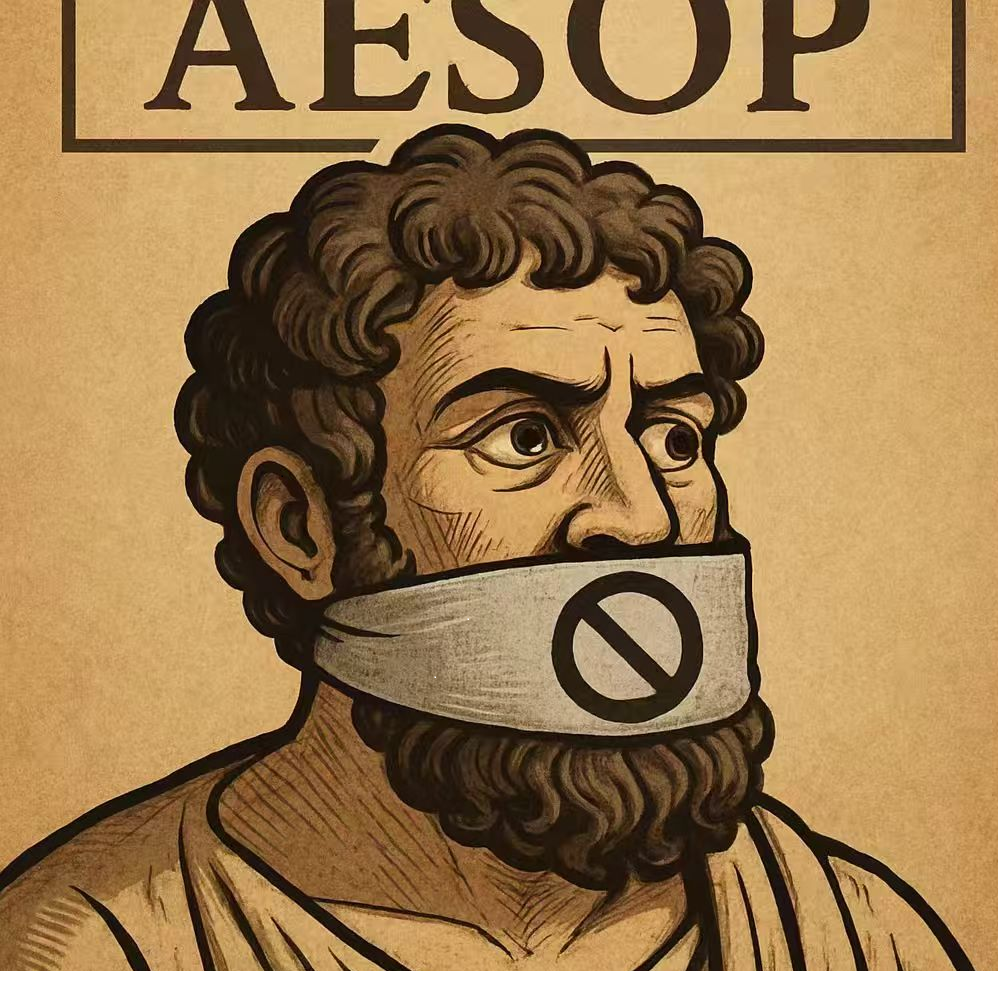

# 千字谜子题 197

## 题面

## 答案

`寓`

## 解析

伊索-->寓言-->禁言-->寓

## 本地附件

- [99dc46c4ec7249e085b4b77ad7db5143.webp](../../../assets/static.cipherpuzzles.com/static/images/99dc46c4ec7249e085b4b77ad7db5143.webp)

来源：[https://ccbc16.cipherpuzzles.com/data/c16-qian-puzzle.json#cid=197](https://ccbc16.cipherpuzzles.com/data/c16-qian-puzzle.json#cid=197)
