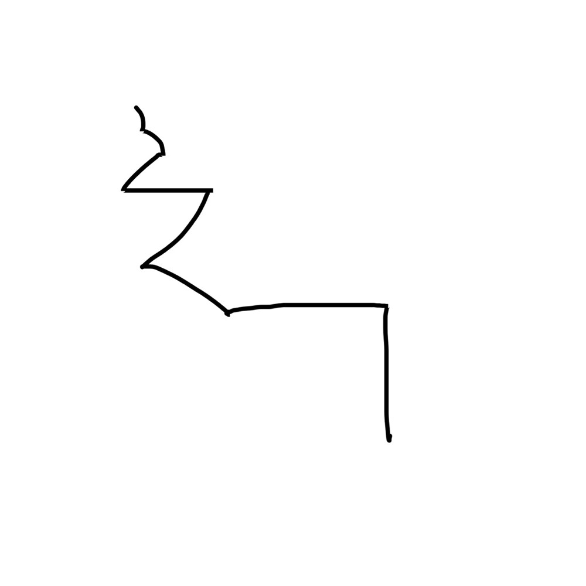

# 千字谜子题 198

## 题面

## 答案

`举`

## 解析

你知道吗？所有的汉字都可以一笔画。

## 本地附件

- [de404761dd984a92bef71627dc4a5f43.webp](../../../assets/static.cipherpuzzles.com/static/images/de404761dd984a92bef71627dc4a5f43.webp)

来源：[https://ccbc16.cipherpuzzles.com/data/c16-qian-puzzle.json#cid=198](https://ccbc16.cipherpuzzles.com/data/c16-qian-puzzle.json#cid=198)
