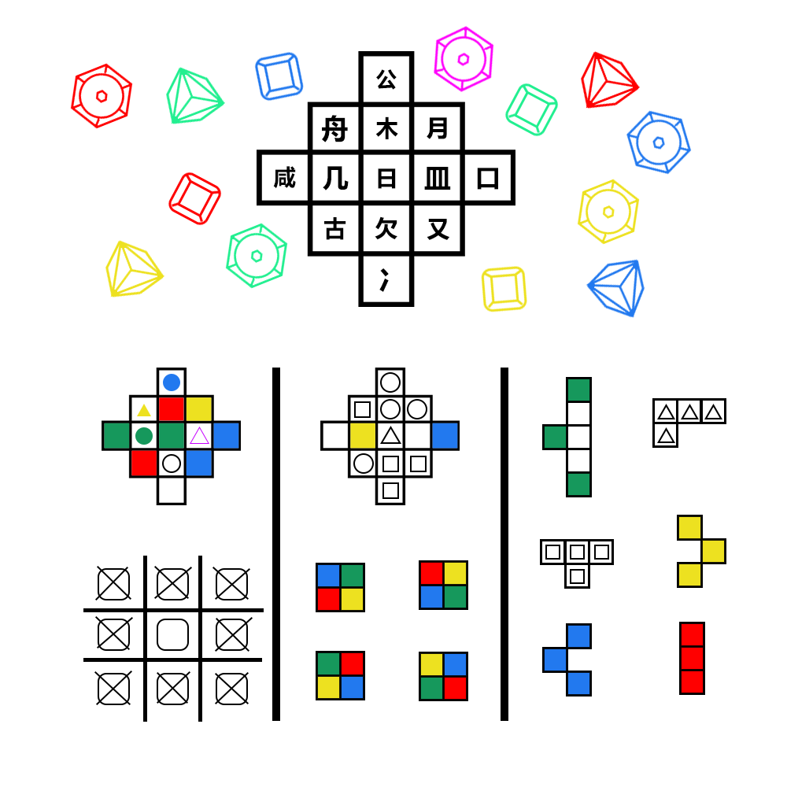

# 千字谜子题 199

## 题面

## 答案

`盗`

## 解析

需要根据下面三列将13颗宝石放入上方的十三个格子中
分别根据三列的要求可以摆出三种放置方法
取每种方案中的紫色水晶的位置的偏旁部首组合成一个字，刚好是答案“盗”字
第一列：放置的宝石要满足相应的格子的需求，带颜色的格子放置的宝石要求颜色一样，带形状的格子要求形状一样，既有颜色又有形状的要求放置的宝石即给定确定的宝石。下方的标志的意思是方块宝石周围不能有方块形状的宝石
第一列可以得出紫色圆形宝石为欠
第二列：同第一列，颜色和形状一一对应，下方的正方形需要满足颜色十二个格子里放置的宝石的颜色排布顺序按照四个格

## 本地附件

- [bcfbc63d97ab4709885eb293360d46b5.webp](../../../assets/static.cipherpuzzles.com/static/images/bcfbc63d97ab4709885eb293360d46b5.webp)

来源：[https://ccbc16.cipherpuzzles.com/data/c16-qian-puzzle.json#cid=199](https://ccbc16.cipherpuzzles.com/data/c16-qian-puzzle.json#cid=199)
