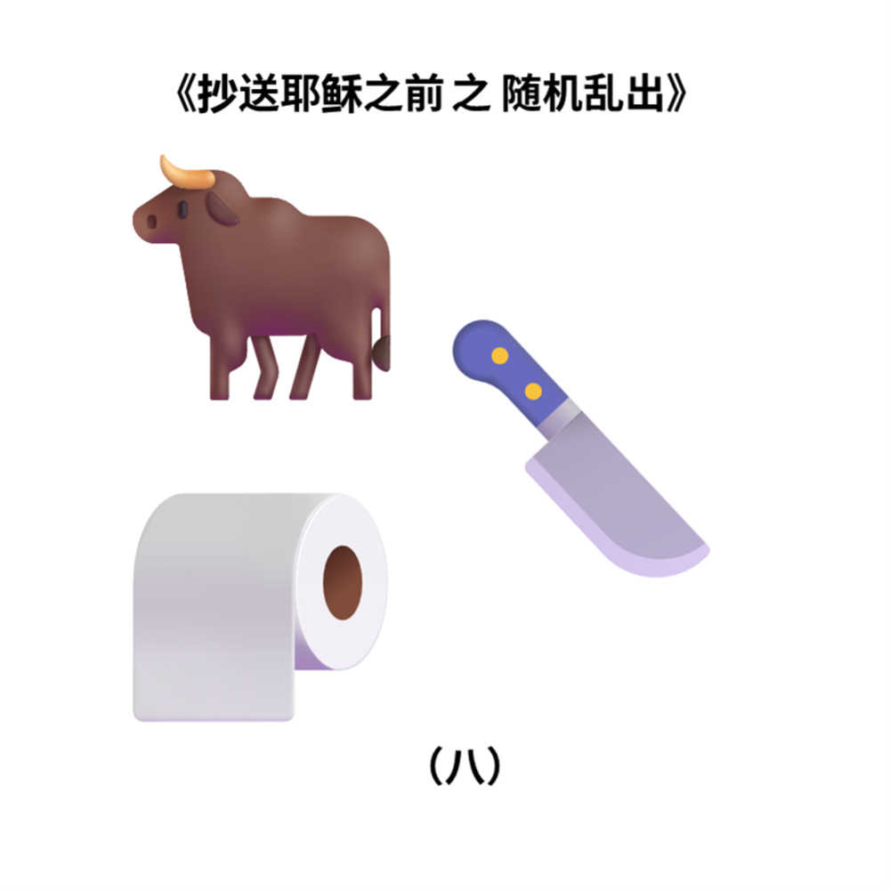

# 千字谜子题 20

## 题面

## 答案

`制`

## 解析

这三个Emoji分别代表“牛”“巾”和“刂”，拼起来就是答案汉字“制”，符合（八）的笔画提示。

## 本地附件

- [65ff241c85a44c25ae4fdb9c5eb34b11.webp](../../../assets/static.cipherpuzzles.com/static/images/65ff241c85a44c25ae4fdb9c5eb34b11.webp)

来源：[https://ccbc16.cipherpuzzles.com/data/c16-qian-puzzle.json#cid=20](https://ccbc16.cipherpuzzles.com/data/c16-qian-puzzle.json#cid=20)
