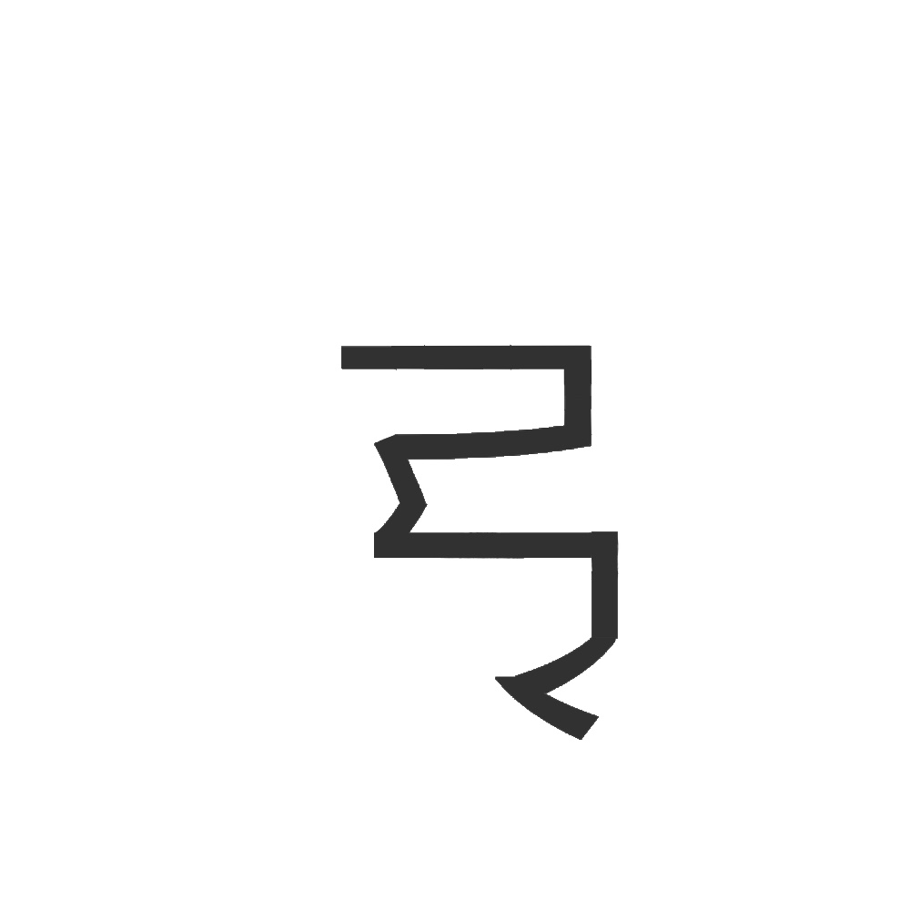

# 千字谜子题 200

## 题面

（十一）

## 答案

`菜`

## 解析

一笔画，图片为按文字笔画一笔画出的图案

## 本地附件

- [7e9a65dd93804e6880da8fab9cfad05d.webp](../../../assets/static.cipherpuzzles.com/static/images/7e9a65dd93804e6880da8fab9cfad05d.webp)

来源：[https://ccbc16.cipherpuzzles.com/data/c16-qian-puzzle.json#cid=200](https://ccbc16.cipherpuzzles.com/data/c16-qian-puzzle.json#cid=200)
